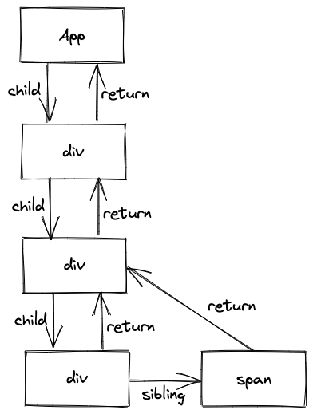
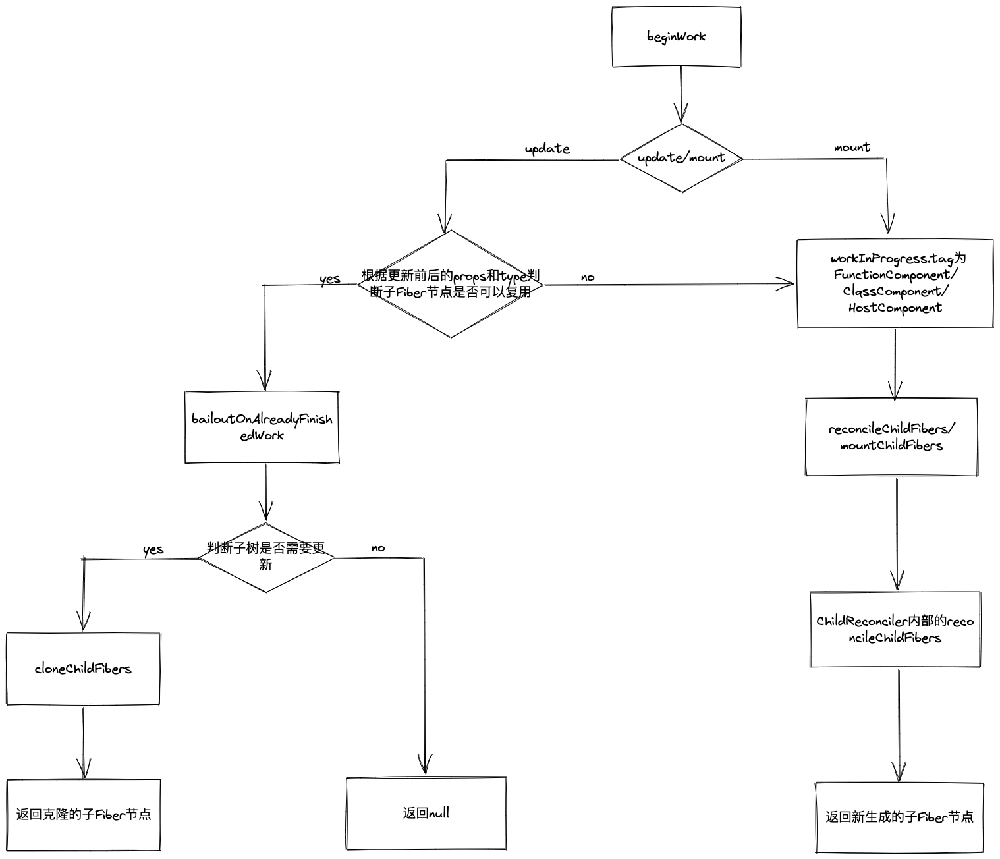
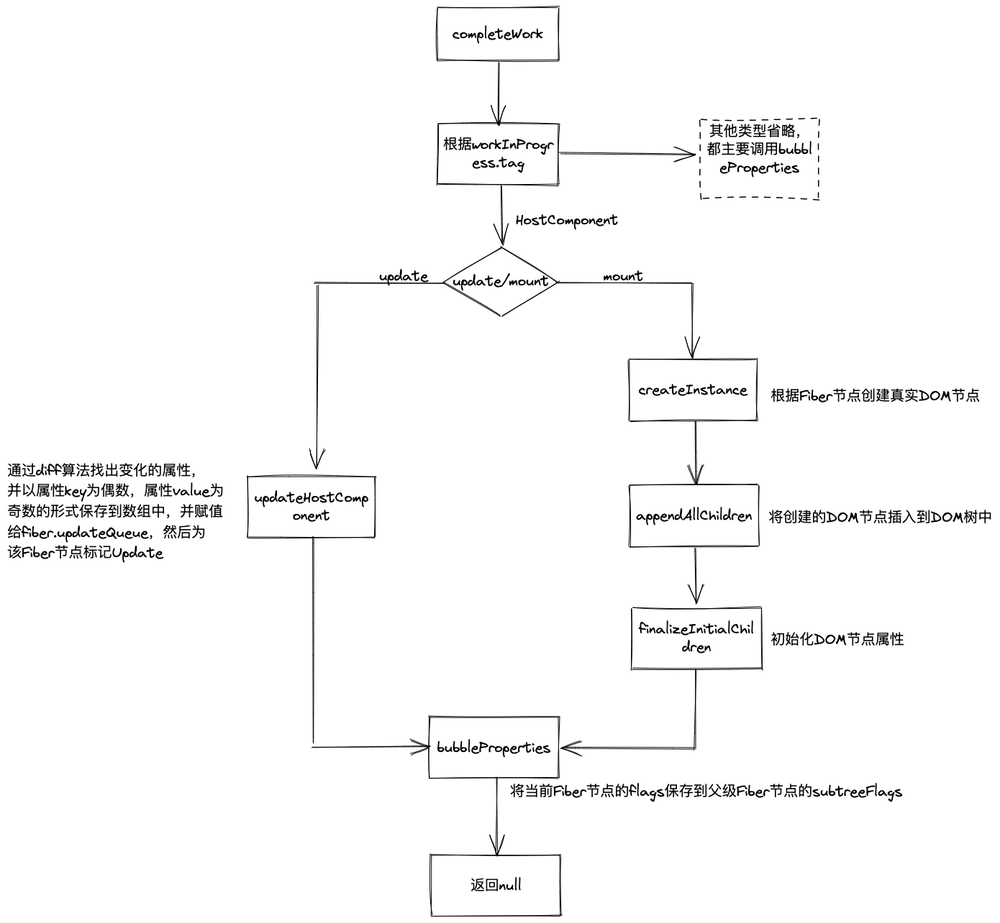

## Reconciler（协调器）

当`Scheduler`调度了`performConcurrentWorkOnRoot`或`performSyncWorkOnRoot`方法之后，就会通过上述两种方法进入`Reconciler`的流程。  

并且整个`Scheduler`与`Reconciler`的工作都是在内存中进行的。只有当所有组件都完成`Reconciler`的工作后，才会统一交给`Renderer`。

### 流程概览
通常，我们说的`Reconciler`架构在源码中对应就是`render`阶段。  
`render`阶段开始于`performSyncWorkOnRoot`或`performConcurrentWorkOnRoot`方法的调用，而这两种方法的调用取决于本次更新是**同步更新**还是**异步更新**。在这里我们只需要知道这两个方法分别会调用如下两个方法：
```js
// performSyncWorkOnRoot会调用该方法
function workLoopSync() {
  while (workInProgress !== null) {
    performUnitOfWork(workInProgress);
  }
}

// performConcurrentWorkOnRoot会调用该方法
function workLoopConcurrent() {
  while (workInProgress !== null && !shouldYield()) {
    performUnitOfWork(workInProgress);
  }
}
```
从代码中可以看到，他们唯一的区别是是否调用了`shouldYield`方法。这个方法的作用是，判断当前浏览器帧是否存在**剩余时间**，如果不存在剩余时间这个方法就会返回*true*，这样判断条件整体就为*false*，即停止了循环操作。反之，如果存在剩余时间会返回*true*，不会停止循环操作。这个`shouldYield`方法是来自`Scheduler`模块。  
我们知道`Fiber Reconciler`是从`Stack Reconciler`重构而来的，通过遍历的方式实现可中断的递归。所以`performUnitOfWork`的工作也分为两部分：“递”阶段和“归”阶段。

### ”递“阶段
首先从`rootFiber`向下深度优先遍历，为遍历到每个`Fiber`节点调用`beginWork`方法。该方法会根据传入的`Fiber`节点创建子`Fiber`节点，并将这两个`Fiber`节点连接起来。当遍历到叶子节点时（即没有子组件的组件）时就会进入“归”阶段。

### “归”阶段
在“归”阶段会调用`completeWork`方法处理`Fiber`节点。当某个`Fiber`节点执行完`completeWork`方法，如果这个节点存在兄弟`Fiber`节点，就会进入兄弟`Fiber`的“递”阶段。如果不存在兄弟`Fiber`节点，就会进入父级`Fiber`节点的“归”阶段。“递”和“归”阶段交错进行，直到"归"到"`rootFiber`。  
至此，`render`阶段的工作就结束了。

### 例子
```js
function App() {
  return (
    <div className="App">
      <div className="App-header">
        <div>Hello</div>
        <span>React</span>
      </div>
    </div>
  );
}
```
这段代码对应的`Fiber`树结构：  
<div align=center></div>

## beginWork

`beginWork`方法对应的代码：
```js
// 简化后的代码
function beginWork(
  current: Fiber | null,
  workInProgress: Fiber,
  renderLanes: Lanes,
): Fiber | null {
    // current不为空就代表当前是update
    if (current !== null) {
        // some code...

      if (
          oldProps !== newProps ||
          hasLegacyContextChanged() ||
          (__DEV__ ? workInProgress.type !== current.type : false)
      ) {
          // 当 props或fiber.type 改变了，就需要更新该Fiber节点
          didReceiveUpdate = true;
      } else {
      // 即更新前后的 props与fiber.type都不变 就代表可以复用更新前一次的current Fiber节点
          didReceiveUpdate = false;
          // 在函数内部调用bailoutOnAlreadyFinishedWork方法
          return attemptEarlyBailoutIfNoScheduledUpdate(
              current,
              workInProgress,
              renderLanes,
          );
      }
    } else {
      didReceiveUpdate = false;
    }

    // mount
    // 根据workInProgress.tag类型的不同做不同的处理
    switch (workInProgress.tag) {
        // 未决的Component
        case IndeterminateComponent: {
            return mountIndeterminateComponent(
                current,
                workInProgress,
                workInProgress.type,
                renderLanes,
            );
        }
        // 函数组件
        case FunctionComponent: {
            const Component = workInProgress.type;
            const unresolvedProps = workInProgress.pendingProps;
            const resolvedProps =
                workInProgress.elementType === Component
                    ? unresolvedProps
                    : resolveDefaultProps(Component, unresolvedProps);
            return updateFunctionComponent(
                current,
                workInProgress,
                Component,
                resolvedProps,
                renderLanes,
            );
        }
        // 类组件
        case ClassComponent: {
            const Component = workInProgress.type;
            const unresolvedProps = workInProgress.pendingProps;
            const resolvedProps =
                workInProgress.elementType === Component
                    ? unresolvedProps
                    : resolveDefaultProps(Component, unresolvedProps);
                return updateClassComponent(
                    current,
                    workInProgress,
                    Component,
                    resolvedProps,
                    renderLanes,
                );
        }
        // 根节点 即rootFiber
        case HostRoot:
            return updateHostRoot(current, workInProgress, renderLanes);
        // 普通的组件 通常使用的div等元素就是HostComponent
        case HostComponent:
            return updateHostComponent(current, workInProgress, renderLanes);
        case HostText:
            return updateHostText(current, workInProgress);
    }
}

function bailoutOnAlreadyFinishedWork(
  current: Fiber | null,
  workInProgress: Fiber,
  renderLanes: Lanes,
): Fiber | null {
  if (current !== null) {
    workInProgress.dependencies = current.dependencies;
  }
  // 优化
  if (!includesSomeLane(renderLanes, workInProgress.childLanes)) {
    // 不需要更新子Fiber树，则直接退出beginWork
    return null;
  }
  // 克隆子Fiber节点
  cloneChildFibers(current, workInProgress);
  // 返回克隆的子Fiber节点
  return workInProgress.child;
}
```
从这段代码可以看到，`beginWork`方法主要就是根据`workInProgress.tag`的不同，来创建不同的子`Fiber`节点。虽然各个组件类型调用的方法都不一样，但是最终都会进入`reconcilerChildren`方法。  
在此之前存在优化逻辑，根据当前`Fiber`节点`props`和`type`来判断是否可以复用前一次更新的`Fiber`节点，如果`props`和`type`都没有改变，则会进入`attemptEarlyBailoutIfNoScheduledUpdate`调用`bailoutOnAlreadyFinishedWork`方法，复用前一次更新的`Fiber`节点。  

然后需要了解处理各个类型的方法都是如何工作的，因为涉及到的代码比较多，所以只看比较重要的部分：
```js
// 未决的Component，在mount时会通过这个方法去处理FunctionComponent
function mountIndeterminateComponent(
  _current,
  workInProgress,
  Component,
  renderLanes,
) {
    if (_current !== null) {
        _current.alternate = null;
        workInProgress.alternate = null;
        // Since this is conceptually a new fiber, schedule a Placement effect
        workInProgress.flags |= Placement;
    }

    const props = workInProgress.pendingProps;
    let value;

    setIsRendering(true);
    ReactCurrentOwner.current = workInProgress;
    //  执行函数和Hooks
    value = renderWithHooks(
      null,
      workInProgress,
      Component,
      props,
      context,
      renderLanes,
    );
    setIsRendering(false);
    // React DevTools reads this flag.
    workInProgress.flags |= PerformedWork;
    // 赋值tag
    workInProgress.tag = FunctionComponent;
    // 根据Component执行的结果，创建对应的子Fiber节点
    reconcileChildren(null, workInProgress, value, renderLanes);
    // 返回创建的子Fiber节点
    return workInProgress.child;
}
// 更新函数组件，代码和mountIndeterminateComponent方法基本一致
function updateFunctionComponent(
  current,
  workInProgress,
  Component,
  nextProps: any,
  renderLanes,
) {

    let context;

    let nextChildren;

    ReactCurrentOwner.current = workInProgress;
    setIsRendering(true);
    // 执行函数和Hooks
    nextChildren = renderWithHooks(
      current,
      workInProgress,
      Component,
      nextProps,
      context,
      renderLanes,
    );
    setIsRendering(false);
    
    // update时，不需要更新函数组件，则复用Hooks和前一次的子Fiber节点
    if (current !== null && !didReceiveUpdate) {
        bailoutHooks(current, workInProgress, renderLanes);
        return bailoutOnAlreadyFinishedWork(current, workInProgress, renderLanes);
    }

    workInProgress.flags |= PerformedWork;
    reconcileChildren(current, workInProgress, nextChildren, renderLanes);
    return workInProgress.child;
}
// 更新类组件
function updateClassComponent(
  current: Fiber | null,
  workInProgress: Fiber,
  Component: any,
  nextProps: any,
  renderLanes: Lanes,
) {
    // Fiber节点对应的真实DOM节点
    const instance = workInProgress.stateNode;
    // 否更新的标志位
    let shouldUpdate;
    // 当DOM节点为空，说明是mount
    if (instance === null) {
        // mount
        if (current !== null) {
            // update
            current.alternate = null;
            workInProgress.alternate = null;
            workInProgress.flags |= Placement;
        }
        // 执行构造函数
        constructClassInstance(workInProgress, Component, nextProps);
        // 挂载ClassComponent
        mountClassInstance(workInProgress, Component, nextProps, renderLanes);
        shouldUpdate = true;
    } else if (current === null) {
        // 重新挂载ClassComponent
        shouldUpdate = resumeMountClassInstance(
            workInProgress,
            Component,
            nextProps,
            renderLanes,
        );
    } else {
        // 更新ClassComponent
        shouldUpdate = updateClassInstance(
            current,
            workInProgress,
            Component,
            nextProps,
            renderLanes,
        );
    }
    // 根据shouldUpdate决定是否执行this.render方法
    // 在finishClassComponent方法内部会直接调用reconcileChildren创建子Fiber节点
    const nextUnitOfWork = finishClassComponent(
        current,
        workInProgress,
        Component,
        shouldUpdate,
        hasContext,
        renderLanes,
    );
    // 返回子Fiber节点
    return nextUnitOfWork;
}
// 更新rootFiber根节点
function updateHostRoot(current, workInProgress, renderLanes) {
    const prevState = workInProgress.memoizedState;
    // 上一次的children
    const prevChildren = prevState.element;
    // 获取当前children
    const nextChildren = nextState.element;
    // 如果前后children相等
    if (nextChildren === prevChildren) {
        // 复用前一次的子Fiber节点
        return bailoutOnAlreadyFinishedWork(current, workInProgress, renderLanes);
    }
    // 创建子Fiber节点
    reconcileChildren(current, workInProgress, nextChildren, renderLanes);
    return workInProgress.child;
}
// 更新原生节点，如div、span等
function updateHostComponent(
  current: Fiber | null,
  workInProgress: Fiber,
  renderLanes: Lanes,
) {
    const type = workInProgress.type;
    const nextProps = workInProgress.pendingProps;
    const prevProps = current !== null ? current.memoizedProps : null;
    // 获取当前children
    let nextChildren = nextProps.children;
    // 判断是否是单个文本节点
    const isDirectTextChild = shouldSetTextContent(type, nextProps);

    if (isDirectTextChild) {
        // 如果是单个文本节点，不需要创建对应的Fiber节点
        nextChildren = null;
    }
    // 创建子Fiber节点
    reconcileChildren(current, workInProgress, nextChildren, renderLanes);
    return workInProgress.child;
}

function updateHostText(current, workInProgress) {
    // 对于文本节点，不需要创建子Fiber节点
    return null;
}
```
从这段代码可以看到，获得`nextChildren`是`reconcileChildren`方法创建子`Fiber`节点的前提条件。而`nextChildren`的值就是当前遍历到的`JSX`对象。所以，r`econcileChildren`会根据参数传入的`JSX`对象创建`Fiber`节点。  

`reconcileChildren`是作为入口函数存在的，目的是区分当前是`mount`还是`update`，来进行不同的处理工作。
```js
function reconcileChildren(
  current: Fiber | null,
  workInProgress: Fiber,
  nextChildren: any,
  renderLanes: Lanes,
) {
  if (current === null) {
        // mount
        // 最终通过reconcileChildFibers创建的Fiber节点会被赋值给workInProgress.child
        // 而workInProgress.child作为本次beginWork方法的返回值
        workInProgress.child = mountChildFibers(
            workInProgress,
            null,
            nextChildren,
            renderLanes,
        );
  } else {
        // update
        workInProgress.child = reconcileChildFibers(
            workInProgress,
            current.child,
            nextChildren,
            renderLanes,
        );
  }
}

const reconcileChildFibers = ChildReconciler(true); // shouldTrackSideEffects为true，表示update
const mountChildFibers = ChildReconciler(false); //  shouldTrackSideEffects为false，表示mount

// 暴露出去的入口函数
function ChildReconciler(shouldTrackSideEffects) { // shouldTrackSideEffects是一个布尔值，用来区分是mount还是update
  // order code...

  // diff算法的主函数
  function reconcileChildFibers() {
    // order code...
  }
  // 其实ChildReconciler就是reconcileChildFibers
  return reconcileChildFibers
}
```
从这段代码可以看到，在入口函数`reconcileChildren`会根据`current`是否存在来判断当前是`mount`还是`update`，然后分别调用`mountChildFibers`或`reconcileChildFibers`方法。  

虽然`reconcileChildren`方法里会根据`mount`或`update`调用不同的函数，但是最终调用的都是同一个函数`ChildReconciler`。`ChildReconciler`函数的传参`shouldTrackSideEffects`会在这个函数内部作为`mount`或`update`的判断标识符。在`ChildReconciler`函数内部还有非常多的方法，但是大部分都是作为辅助函数存在的，会通过`reconcileChildFibers`方法直接或间接调用。  

`reconcileChildFibers`方法的目的是用来创建`Fiber`节点，创建的过程也会区别是`mount`或`update`。`mount`的话就直接根据`JSX`对象创建对应的`Fiber`节点就可以了，但是`update`就需要通过`diff`算法来判断原`Fiber`节点是否可以复用，可以复用的话会复用原`Fiber`节点，不可以复用的话则会删除掉原`Fiber`节点然后再根据`JSX`对象创建对应的`Fiber`节点。因为`reconcileChildFibers`函数内部代码量比较多，所以会在diff算法中介绍。  

调用`reconcileChildFibers`方法创建的`Fiber`节点一般都会被标记相应的`flags`，这个`flags`表示该`Fiber`节点对应的`DOM`节点需要执行怎样的操作，包括*插入*、*更新*或*删除*。当`mount`时，因为是首屏渲染，所以在此时创建的`Fiber`节点都会被标记为`Placement`，表示该`Fiber`节点对应的`DOM`节点需要插入到页面中。在`update`时，当一个`Fiber`节点的属性变化了，就会为该`Fiber`节点标记为`Update`，表示该`Fiber`节点对应的`DOM`节点需要进行更新。  
```js
// effecTag被定义为32个二进制位
// DOM需要插入到页面中
const Placement = /*                */ 0b00000000000010;
// DOM需要更新
const Update = /*                   */ 0b00000000000100;
// DOM需要插入到页面中并更新
const PlacementAndUpdate = /*       */ 0b00000000000110;
// DOM需要删除
const Deletion = /*                 */ 0b00000000001000;

// 在reconcileChildFibers方法内部会调用placeSingleChild
function placeSingleChild(newFiber: Fiber): Fiber {
  // shouldTrackSideEffects为true时，表示当前是update
  // newFiber.alternatew诶空，表示当前Fiber节点没有对应的current Fiber节点，说明当前是一个新增Fiber节点
  if (shouldTrackSideEffects && newFiber.alternate === null) {
    // 同时满足以上两点，才会为当前Fiber节点标记为Placement
    // |= 属于位运算符，表示按位或，相当于将Placement保存到newFiber.flags
    newFiber.flags |= Placement;
  }
  return newFiber;
}
```
以上这些工作都属于`render`阶段，而`render`阶段的工作是在内存中进行的，当工作结束后会通知`Renderer`需要执行的`DOM`操作。要执行`DOM`操作的具体类型就保存在`fiber.flags`中。  

虽然，`beginWork`方法内部涉及到的代码很多，但是主要的工作流程是比较清晰的。根据`workInProgres.tag`的不同创建对应的`Fiber`节点，且只会创建并初始化第一个子`Fiber`节点，并为这个`Fiber`节点标记`flags`，随后返回这个`Fiber`节点作为本次`beginWork`方法的返回值，并作为下次`performUnitOfWork`方法的`workInProgress`参数。

## completeWork

`completeWork`方法会通过`completeUnitOfWork`循环调用，因为执行顺序是从叶子节点向上遍历到根节点，与`beginWork`方法的顺序是相反的。
```js
// 简化后
function completeUnitOfWork(unitOfWork: Fiber): void {
  // 当前执行completeWork的Fiber节点
  let completedWork = unitOfWork;
  do {
    const current = completedWork.alternate;
    // 当前Fiber节点父级Fiber节点
    const returnFiber = completedWork.return;

    let next;
    // 执行完completeWork方法通常会返回null
    next = completeWork(current, completedWork, subtreeRenderLanes);
    // 通常next都为null
    if (next !== null) {
      workInProgress = next;
      return;
    }
    // 获取当前Fiber节点的兄弟Fiber节点
    const siblingFiber = completedWork.sibling;
    // 当存在兄弟Fiber节点
    if (siblingFiber !== null) {
      // 执行兄弟Fiber节点的beginWork方法
      workInProgress = siblingFiber;
      // 退出本次completeWork
      return;
    }
    // completeWork被赋值为当前Fiber节点的父级Fiber节点，就会向上循环执行
    completedWork = returnFiber;
    // workInProgress是全局变量
    workInProgress = completedWork;
  } while (completedWork !== null);
}
```
然后接下来需要重点看下`completeWork`方法：
```js
// 简化后
function completeWork(
  current: Fiber | null,
  workInProgress: Fiber,
  renderLanes: Lanes,
): Fiber | null {
  const newProps = workInProgress.pendingProps;

  switch (workInProgress.tag) {
    case IndeterminateComponent:
    case FunctionComponent:
      // 属性冒泡
      // 遍历当前Fiber节点的所有子Fiber节点，将子Fiber节点的flags和subtreeFlags属性保存到当前Fiber节点的subtreeFlags属性
      // 简单来说，就是收集子Fiber节点的flags，保存到父级Fiber的subtreeFlags
      bubbleProperties(workInProgress);
      return null;
    case ClassComponent: {
      bubbleProperties(workInProgress);
      return null;
    }
    case HostRoot: {
      bubbleProperties(workInProgress);
      return null;
    }
    case HostComponent: {
      const type = workInProgress.type;
      if (current !== null && workInProgress.stateNode != null) {
        // update
        // 通过diffProperties方法，找出变化的属性值组成的数组updatePayload，偶数为prop key，奇数为prop value组成的数组，并将这个数组保存到fiber.updateQueue中
        updateHostComponent(
          current,
          workInProgress,
          type,
          newProps,
        );
      } else {
        // mount
        // 根据当前的Fiber节点创建对应的真实DOM节点
        const instance = createInstance(
          type,
          newProps,
          workInProgress,
        );
        // 将已经创建出来的DOM树，调用appendChild方法插入到刚生成的DOM节点中
        // instance.appendChild(workInProgress.child.stateNode)
        appendAllChildren(instance, workInProgress);
        // 将Fiber节点的stateNode属性指向真实DOM节点
        // 而真实的DOM节点也有一个internalInstanceKey属性来指向Fiber节点
        workInProgress.stateNode = instance;

        if (
          // 初始化真实DOM节点上的属性，如STYLE，DANGEROUSLY_SET_INNER_HTML，CHILDREN等属性
          // finalizeInitialChildren方法的返回值是用来处理文本框的autofocus属性，如果不是文本框就返回false
          finalizeInitialChildren(
            instance,
            type,
            newProps,
            rootContainerInstance,
            currentHostContext,
          )
        ) {
          // 为当前Fiber节点标记Update
          markUpdate(workInProgress);
        }
      }
      bubbleProperties(workInProgress);
      return null;
    }
    case HostText: {
      const newText = newProps;
      if (current && workInProgress.stateNode != null) {
        // update
        const oldText = current.memoizedProps;
        // 为当前Fiber节点打上Update flags，表示需要更新文本节点
        updateHostText(current, workInProgress, oldText, newText);
      } else {
        // mount
        // 通过createTextNode方法创建一个文本节点并返回
        // 返回值作为真实DOM节点
        workInProgress.stateNode = createTextInstance(
            newText,
            rootContainerInstance,
            workInProgress,
          );
      }
      bubbleProperties(workInProgress);
      return null;
    }
  }
}

updateHostComponent = function(
    current: Fiber,
    workInProgress: Fiber,
    type: Type,
    newProps: Props,
  ) {
  const oldProps = current.memoizedProps;
  if (oldProps === newProps) {
    // 更新前后的props没有变化，则直接返回
    return;
  }

  const instance: Instance = workInProgress.stateNode;
  // 在prepareUpdate方法内部调用diffProperties方法收集变化的属性
  const updatePayload = prepareUpdate(
    instance,
    type,
    oldProps,
    newProps,
  );
  // 将变化属性的集合保存在fiber.updateQueue
  workInProgress.updateQueue = (updatePayload: any);

  if (updatePayload) {
    // 存在updatePayload则说明存在变化的属性，代表当前Fiber节点需要更新。所以为该Fiber节点标记Update
    markUpdate(workInProgress);
  }
};

// 简化后
function diffProperties(
  domElement: Element,
  tag: string,
  lastRawProps: Object,
  nextRawProps: Object,
  rootContainerElement: Element | Document,
): null | Array<mixed> {
  // 保存变化属性的变量
  let updatePayload: null | Array<any> = null;

  let propKey; // 遍历到的属性名
  let styleName;  
  let styleUpdates = null;  // 用来收集style的对象
  // 遍历旧props
  for (propKey in lastProps) {
    if (
      nextProps.hasOwnProperty(propKey) ||
      !lastProps.hasOwnProperty(propKey) ||
      lastProps[propKey] == null
    ) {
      continue;
    }
    if (propKey === STYLE) {
      // 处理style属性
      const lastStyle = lastProps[propKey];
      // 遍历style对象
      for (styleName in lastStyle) {
        if (lastStyle.hasOwnProperty(styleName)) {
          if (!styleUpdates) {
            // 初始化styleUpdates
            styleUpdates = {};
          }
          // 保存遍历到的styleName，并且值为‘’
          styleUpdates[styleName] = '';
        }
      }
    } else {
      // 没有命中以上判断，则该propKey为null
      (updatePayload = updatePayload || []).push(propKey, null);
    }
  }
  // 遍历新props
  for (propKey in nextProps) {
    // 新属性值
    const nextProp = nextProps[propKey];
    // 旧属性值
    const lastProp = lastProps != null ? lastProps[propKey] : undefined;
    if (
      !nextProps.hasOwnProperty(propKey) ||
      nextProp === lastProp ||
      (nextProp == null && lastProp == null)
    ) {
      continue;
    }
    if (propKey === STYLE) {
      if (lastProp) {
        // 遍历旧style属性
        for (styleName in lastProp) {
          if (
            lastProp.hasOwnProperty(styleName) &&
            (!nextProp || !nextProp.hasOwnProperty(styleName))
          ) {
            // 旧style有styleName，但是新style没有对应的styleName，需要将styleName对应的值置为空
            if (!styleUpdates) {
              styleUpdates = {};
            }
            // styleName对应的值为置为空
            styleUpdates[styleName] = '';
          }
        }
        // 遍历新style属性
        for (styleName in nextProp) {
          if (
            nextProp.hasOwnProperty(styleName) &&
            lastProp[styleName] !== nextProp[styleName]
          ) {
            if (!styleUpdates) {
              // 初始化
              styleUpdates = {};
            }
            // 新styleName对应的值为旧styleName对应的值
            styleUpdates[styleName] = nextProp[styleName];
          }
        }
      } else {
        // 旧props不存在style属性
        if (!styleUpdates) {
          if (!updatePayload) {
            // 初始化
            updatePayload = [];
          }
          // 将收集到的style对象保存到updatePayload
          updatePayload.push(propKey, styleUpdates);
        }
        // styleUpdates赋值为新style
        styleUpdates = nextProp;
      }
    } else if (propKey === DANGEROUSLY_SET_INNER_HTML) {
      // 处理富文本属性
      const nextHtml = nextProp ? nextProp[HTML] : undefined;
      const lastHtml = lastProp ? lastProp[HTML] : undefined;
      if (nextHtml != null) {
        // 存在新富文本的html值
        if (lastHtml !== nextHtml) {
          // 新旧html值不相等
          // 将html值保存到updatePayload
          (updatePayload = updatePayload || []).push(propKey, nextHtml);
        }
      }
    } else if (propKey === CHILDREN) {
      // 处理children属性
      if (typeof nextProp === 'string' || typeof nextProp === 'number') {
        // 将文本节点的值保存到updatePayload
        (updatePayload = updatePayload || []).push(propKey, '' + nextProp);
      }
    } else {
      // 没有命中以上逻辑，将其他属性保存到updatePayload
      (updatePayload = updatePayload || []).push(propKey, nextProp);
    }
  }
  if (styleUpdates) {
    // 将收集的style属性保存到updatePayload
    (updatePayload = updatePayload || []).push(STYLE, styleUpdates);
  }
  // 返回updatePayload
  return updatePayload;
}
```
可以看到`completeWork`方法也会区分`mount`和`update`来做不同的处理。  

在`mount`时，会为`Fiber`节点创建对应的真实`DOM`节点，并将子孙`DOM`节点插入到刚生成的真实`DOM`节点中，然后再为真实`DOM`节点初始化一些内部属性。  

当`update`时，则主要通过`diffProperties`方法，计算出变化的属性并将变化的属性保存到`updatePayload`数组中，最后返回一个需要更新的由*属性名*为偶数和*属性值*为奇数组成的数组，然后将返回值`updatePayload`保存到`fiber.updateQueue`属性。  

该过程中经过不断的调用`completeWork`方法，最后**“归”**到`rootFiber`的时候，就已经生成一颗构建好的离屏`DOM`树。  

## 总结

beginWork大致流程图：

completeWork大致流程图：

