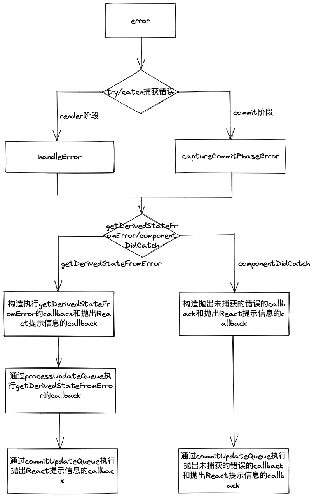

## Error Boundary

React官网对于错误边界的描述是：
> 错误边界是一种 React 组件，这种组件可以捕获发生在其子组件树任何位置的 JavaScript 错误，并打印这些错误，同时展示降级 UI，而并不会渲染那些发生崩溃的子组件树。  
> 如果一个 class 组件中定义了 static getDerivedStateFromError() 或 componentDidCatch() 这两个生命周期方法中的任意一个（或两个）时，那么它就变成一个错误边界。

从这段描述中可以了解到，`Error Boundary`是一种组件，并且需要定义`static getDerivedStateFromError() `或` componentDidCatch()`生命周期方法。  
它自身包括三种功能：
+ 捕获渲染期间的错误
+ 打印这些错误
+ 展示降级UI  

可以说，`Error Boundary`虽然是一个新的概念，但是功能和使用方式是比较单一的，只能作为组件存在，并且只负责捕获和处理React内部抛出的错误。  

接下来，将从源码的角度看看`React`是怎么实现的。  

## 捕获错误

首先需要明确React的工作流程，一共分为三步：
+ 触发更新
+ 在`render阶段`计算更新造成的副作用
+ 在`commit阶段`执行副作用  

`React`的工作流程只包括`render阶段`和`commit阶段`。所以只有发生在这两个阶段内部的错误才会被`Error Boundary`定义的方法捕获到。那么在工作流程中的错误都是被怎么样捕获的呢？
```js
function renderRootSync(
    root: FiberRoot, 
    lanes: Lanes
) {
    // order code...

    do {
        try {
            workLoopSync();
            break;
        } catch (thrownValue) {
            // 捕获render阶段抛出错误的方法
            handleError(root, thrownValue);
        }
    } while (true);
    // order code...
}
```
从这段代码可以看出，在`render阶段`的入口函数`workLoopSync`被包裹在`try catch语句`中来捕获执行过程中可能抛出的错误，一旦有错误抛出就会被`catch`接收到并传递给`handleError`方法来处理这个错误。  
而`commit阶段`使用的是相同的写法，将`captureCommitPhaseError`方法放在`catch`语句中接收被捕获的错误并做相应的处理。而因为`commit阶段`包括很多子阶段，所以在`commit阶段`的内部会出现很多被`try catch语句`包裹的地方，这些地方都同样使用了`captureCommitPhaseError`方法来处理错误。
```js
try {
    // commit阶段调用的方法
} catch (error) {
    captureCommitPhaseError(fiber, fiber.return, error);
}
```
## 构造callback

不管是`handleError`还是`captureCommitPhaseError`，都会从发生错误的节点的父节点开始，逐层向上遍历，寻找离它最近的`Error Boundary`。当找到了`Error Boundary`，大致会做两件事：
+ 构造用于执行`Error Boundary`方法的`callback`
+ 构造用于抛出`React`提示信息的`callback  `

具体代码如下所示：
```js
function createClassErrorUpdate(
  fiber: Fiber,
  errorInfo: CapturedValue<mixed>,
  lane: Lane,
): Update<mixed> {
    // 创建update对象
    const update = createUpdate(NoTimestamp, lane);
    // update的类型为捕获型Update
    update.tag = CaptureUpdate;
    // 获取静态方法getDerivedStateFromError
    const getDerivedStateFromError = fiber.type.getDerivedStateFromError;
    if (typeof getDerivedStateFromError === 'function') {
        const error = errorInfo.value;
        // 用于执行getDerivedStateFromError的callback
        update.payload = () => {
            return getDerivedStateFromError(error);
        };
        // 用于抛出React提示信息的callback
        update.callback = () => {
            logCapturedError(fiber, errorInfo);
        };
    }

    const inst = fiber.stateNode;
    if (inst !== null && typeof inst.componentDidCatch === 'function') {
        update.callback = function callback() {
            // 用于抛出React提示信息的callback
            logCapturedError(fiber, errorInfo);
            const error = errorInfo.value;
            const stack = errorInfo.stack;
            // 用于执行componentDidCatch的callback
            this.componentDidCatch(error, {
                componentStack: stack !== null ? stack : '',
            });
        };
    }
    return update;
}
```
如果没有找到`Error Boundary`，就会继续向上遍历直到根节点。同样也会构造两个`callback`。
```js
function createRootErrorUpdate(
  fiber: Fiber,
  errorInfo: CapturedValue<mixed>,
  lane: Lane,
): Update<mixed> {
    // 创建update对象
    const update = createUpdate(NoTimestamp, lane);
    update.tag = CaptureUpdate;
    update.payload = {element: null};
    // 获取error
    const error = errorInfo.value;
    update.callback = () => {
        // 抛出未捕获的错误的callback
        onUncaughtError(error);
        // 抛出React提示信息的callback
        logCapturedError(fiber, errorInfo);
    };
    return update;
}
```
当构造完这两种`callback`，最终又是如何执行的呢？

## 执行callback

被构造的`callback`都被放在了一个匿名函数中，然后保存到`update.callback`属性上。而计算`update`的工作是在`processUpdateQueue`方法（render阶段的beginWork中调用）中进行的。
```js
export function processUpdateQueue<State>(
  workInProgress: Fiber,
   props: any,
  instance: any,
  renderLanes: Lanes,
): void {
   // 计算update.payload
   // getDerivedStateFromError会在getStateFromUpdate方法内被执行
   // getDerivedStateFromError的返回值会合并到this.state中，合并的结果会作为getStateFromUpdate方法的返回值
    newState = getStateFromUpdate(
        workInProgress,
        queue,
        update,
        newState,
        props,
        instance,
    );
    // 这个callback就是抛出未捕获的错误的callback和抛出React提示信息的callback的方法
    const callback = update.callback;

    if (
        callback !== null &&
        update.lane !== NoLane
    ) {
        workInProgress.flags |= Callback;
        const effects = queue.effects;
        // 具有callback的update，都会被保存到effects数组中
        if (effects === null) {
            queue.effects = [update];
        } else {
            effects.push(update);
        }
    }
}
```
从这段代码可以看出，具有`callback`值的`update`会被保存到`effects`这个数组中。这个`effects`数组会收集所有具有副作用的`update`对象，最终在`commit阶段`执行，再准确一点就是`commit阶段`的子`layout阶段`。
```js
function commitUpdateQueue<State>(
  finishedWork: Fiber,
  finishedQueue: UpdateQueue<State>,
  instance: any,
): void {
    // 获取effects
    const effects = finishedQueue.effects;
    finishedQueue.effects = null;
    if (effects !== null) {
        // 遍历effects数组
        for (let i = 0; i < effects.length; i++) {
            const effect = effects[i];
            const callback = effect.callback;
            if (callback !== null) {
                effect.callback = null;
                // 执行callback
                callCallback(callback, instance);
            }
        }
    }
}
```
执行副作用的方法是`commitUpdateQueue`，这个方法会通过`commitLayoutEffectOnFiber`函数调用。  
其实整个上述**构造callback**和**执行callback**的流程和使用`this.setState`方法时的流程几乎是一致的，甚至可以说`React`利用这种**执行自定义callback**的特性所实现的新功能。  
在React中有两个**执行用户自定义callback**的方法：
+ 对于ClassComponent，`this.setState(newState, callback)`
+ 对于根节点，`ReactDOM.render(element, container, callback)  `

在`this.setState`方法中，`newState`和`callback`都可以传递函数作为参数。所以对于调用`static getDerivedStateFromError`方法处理抛出的错误时，相当于调用`this.setState`主动触发了一次更新:
```js
this.setState(() => {
  // 用于执行getDerivedStateFromError的callback
}, () => {
  // 用于抛出React提示信息的callback
})
```
调用`componentDidCatch`生命周期方法的效果也是一样的：
```js
this.setState({}, () => {
  // 用于执行componentDidCatch的callback
  // 以及 用于抛出React提示信息的callback
})
```
使用根节点捕获抛出的错误则是利用了`ReactDOM.render`方法的第三个参数`callback`：
```js
ReactDOM.render(element, container, () => {
    // 用于抛出“未捕获的错误”及“React的提示信息”的callback
})
```
## 总结

通过上述的讲解，相信各位对于`Error Boundary`的工作原理有了比较清楚的认识。  
`React`官网，在介绍`Error Boundary`时明确说明了4种情况的错误不会被`Error Boundary`捕获：
+ 事件处理
+ 异步代码
+ 服务端渲染
+ 它自身抛出来的错误  

从原理的角度出发，一定能够解答造成这4种情况的原因。  

Error Boundary工作流程图：  
<div align=center>
  
</div>
