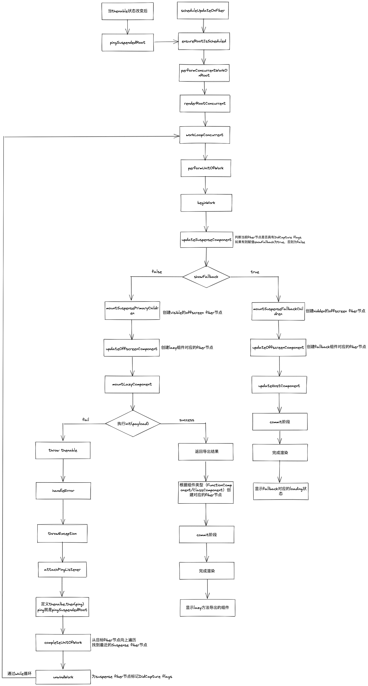

## Suspense

`React`官网对于`Suspense`的描述是：
> Suspense 使得组件可以“等待”某些操作结束后，再进行渲染。

`Suspense`是`React`提出的一种以同步的代码来实现异步操作的方案。`Suspense`让组件*等待*异步操作，异步请求结束后在进行组件的渲染，也就是所谓的**异步渲染**。  

而且`Suspense`的用法也比较简单，通常作为一种容器组件使用就可以。它具有一个`fallback`属性，用来代替当`Suspense`处于`loading`状态下渲染的内容，`Suspense`的`children`就是异步组件。多个异步组件可以用`Suspense`嵌套使用。  

例如：
```js
const LazyComponent = React.lazy(()=>import('./index')))

function Index() {

    return <div>
        <Suspense fallback={ <div>LOADING...</div> }>
            <LazyComponent />
        </Suspense>
    </div>
}
```
`Suspense`包裹异步渲染组件`LazyComponent`，当`LazyComponent`处于加载状态下，将会降级展示`fallback`属性中的内容。  

## 动态加载

通常`Suspense`会配合`React.lazy`实现动态加载的功能。  

用法如下：
```js
const LazyComponent = React.lazy(()=>import('./index'));
```
`React.lazy`接收一个函数，这个函数需要动态调用`import`方法。它必须返回一个`Promise`，该`Promise`需要`resolve`一个以`export default`方式导出的`React`组件。  

使用`React.lazy`动态引入的组件，很利于**代码分割**，可以在项目初始化的时候不必加载大量的文件，以此来提升性能。  

## Suspense的实现

`Suspense`属于一种组件，所以会在`beginWork`方法中处理该类型的组件。
```js
function beginWork(
  current: Fiber | null,
  workInProgress: Fiber,
  renderLanes: Lanes,
): Fiber | null {
  // order code...

  switch (workInProgress.tag) {

    case SuspenseComponent:
      return updateSuspenseComponent(current, workInProgress, renderLanes);
    
  );
  // order code...
}
```
从这段代码可以看到，`Suspense`类型的组件会调用`updateSuspenseComponent`方法处理。
```js
// 由于代码量非常多，所以只关注主要的逻辑
function updateSuspenseComponent(current, workInProgress, renderLanes) {
  const nextProps = workInProgress.pendingProps;

  let suspenseContext: SuspenseContext = suspenseStackCursor.current;
  // 是否显示fallback
  let showFallback = false;
  // 是否悬停，需要通过判断flags是否包含DidCapture flags
  // DidCapture表示捕获了错误，如果捕获了错误的话，则需要悬停来处理这个错误
  const didSuspend = (workInProgress.flags & DidCapture) !== NoFlags;
  // 是否需要悬停
  if (
    didSuspend
  ) {
    // 需要悬停
    // 赋值showFallback
    showFallback = true;
    // 为workInProgress fiber清除DidCapture flags
    workInProgress.flags &= ~DidCapture;
  }
   if (current === null) {
    //  mount时

    // 获取原始子组件
    const nextPrimaryChildren = nextProps.children;
    // 获取fallback对应的组件
    const nextFallbackChildren = nextProps.fallback;
    // 是否展示fallback
    if (showFallback) {
      // 展示fallback
      // 通过mountSuspenseFallbackChildren方法创建fallback对应的fiber节点
      const fallbackFragment = mountSuspenseFallbackChildren(
        workInProgress,
        nextPrimaryChildren,
        nextFallbackChildren,
        renderLanes,
      );
      // 获取原始子组件对应的fiber节点
      const primaryChildFragment: Fiber = (workInProgress.child: any);
      // 赋值变量
      primaryChildFragment.memoizedState = mountSuspenseOffscreenState(
        renderLanes,
      );
      workInProgress.memoizedState = SUSPENDED_MARKER;
      // 返回fallback对应的fiber节点
      // 这样在页面显示就是fallback对应的组件，而不显示真正的子组件
      return fallbackFragment;
    } else {
      // 不展示fallback，则显示真正的子组件，创建子组件对应的fiber节点
      return mountSuspensePrimaryChildren(
        workInProgress,
        nextPrimaryChildren,
        renderLanes,
      );
    }
  } else {
    // update时

    // 如果current fiber存在suspenseState属性，说明已经展示过fallback了
    const prevState: null | SuspenseState = current.memoizedState;
    if (prevState !== null) {
      // current fiber树已经展示fallback

      if (showFallback) {
        // 展示fallback
        // 获取fallback属性
        const nextFallbackChildren = nextProps.fallback;
        // 获取子组件
        const nextPrimaryChildren = nextProps.children;
        // 创建fallback对应的fiber节点
        const fallbackChildFragment = updateSuspenseFallbackChildren(
          current,
          workInProgress,
          nextPrimaryChildren,
          nextFallbackChildren,
          renderLanes,
        );
        // 获取子组件对应的fiber节点
        const primaryChildFragment: Fiber = (workInProgress.child: any);
        // 获取current fiber上的memoizedState属性
        const prevOffscreenState: OffscreenState | null = (current.child: any)
          .memoizedState;
        // 判断子组件是否存在变化
        primaryChildFragment.memoizedState =
          prevOffscreenState === null
            ? mountSuspenseOffscreenState(renderLanes)
            : updateSuspenseOffscreenState(prevOffscreenState, renderLanes);
        primaryChildFragment.childLanes = getRemainingWorkInPrimaryTree(
          current,
          renderLanes,
        );
        workInProgress.memoizedState = SUSPENDED_MARKER;
        // 返回fallback对应的fiber
        return fallbackChildFragment;
      } else {
        // 不需要展示fallback
        // 获取子组件
        const nextPrimaryChildren = nextProps.children;
        // 创建子组件对应的fiber节点
        const primaryChildFragment = updateSuspensePrimaryChildren(
          current,
          workInProgress,
          nextPrimaryChildren,
          renderLanes,
        );
        workInProgress.memoizedState = null;
        // 返回子组件对应的fiber节点
        return primaryChildFragment;
      }
    } else {
      // 跟上面的逻辑几乎一致
      if (showFallback) {
        const nextFallbackChildren = nextProps.fallback;
        const nextPrimaryChildren = nextProps.children;
        const fallbackChildFragment = updateSuspenseFallbackChildren(
          current,
          workInProgress,
          nextPrimaryChildren,
          nextFallbackChildren,
          renderLanes,
        );
        const primaryChildFragment: Fiber = (workInProgress.child: any);
        const prevOffscreenState: OffscreenState | null = (current.child: any)
          .memoizedState;
        primaryChildFragment.memoizedState =
          prevOffscreenState === null
            ? mountSuspenseOffscreenState(renderLanes)
            : updateSuspenseOffscreenState(prevOffscreenState, renderLanes);
        primaryChildFragment.childLanes = getRemainingWorkInPrimaryTree(
          current,
          renderLanes,
        );
        // Skip the primary children, and continue working on the
        // fallback children.
        workInProgress.memoizedState = SUSPENDED_MARKER;
        return fallbackChildFragment;
      } else {
        // Still haven't timed out. Continue rendering the children, like we
        // normally do.
        const nextPrimaryChildren = nextProps.children;
        const primaryChildFragment = updateSuspensePrimaryChildren(
          current,
          workInProgress,
          nextPrimaryChildren,
          renderLanes,
        );
        workInProgress.memoizedState = null;
        return primaryChildFragment;
      }
    }
  }
}
```
从这段代码可以看到，`updateSuspenseComponent`方法主要做的工作就是判断是否展示`fallback`，然后创建并返回相应的`fiber`节点。  

如果需要显示`fallback`则返回`fallback`对应的`fiber`节点，如果不需要显示`fallback`则返回真正子组件对应的`fiber`节点。  

那么子`fiber`节点是怎么创建的呢？
```js
// 创建原始子组件对应的fiber节点
function mountSuspensePrimaryChildren(
  workInProgress,
  primaryChildren,
  renderLanes,
) {
  const mode = workInProgress.mode;
  // 创建子fiber节点的props
  const primaryChildProps: OffscreenProps = {
    // 子组件是否可见
    mode: 'visible',
    // 子组件
    children: primaryChildren,
  };
  // 创建子组件对应的fiber节点
  const primaryChildFragment = mountWorkInProgressOffscreenFiber(
    primaryChildProps,
    mode,
    renderLanes,
  );
  // 将子fiber节点与父级fiber节点连接形成fiber树
  // 子组件fiber节点的return指针指向父级fiber节点
  primaryChildFragment.return = workInProgress;
  // 父级fiber节点的child指针指向子组件fiber节点
  workInProgress.child = primaryChildFragment;
  // 返回子fiber节点
  return primaryChildFragment;
}
// 创建fallback组件对应的fiber节点
function mountSuspenseFallbackChildren(
  workInProgress,
  primaryChildren,
  fallbackChildren,
  renderLanes,
) {
  // 获取workInProgress fiber的mode属性
  const mode = workInProgress.mode;
  // 获取workInProgress fiber的子fiber节点
  const progressedPrimaryFragment: Fiber | null = workInProgress.child;
  // 创建子fiber节点的props
  const primaryChildProps: OffscreenProps = {
    // 子组件是否可见
    mode: 'hidden',
    // 子组件
    children: primaryChildren,
  };
  let primaryChildFragment;
  let fallbackChildFragment;
  // 创建子组件对应的fiber节点
  primaryChildFragment = mountWorkInProgressOffscreenFiber(
    primaryChildProps,
    mode,
    NoLanes,
  );
  // 创建fallback对应的fiber节点
  fallbackChildFragment = createFiberFromFragment(
    fallbackChildren,
    mode,
    renderLanes,
    null,
  );
  // 将这两个fiber节点连接起来，与父级fiber节点一并形成fiber树
  // 子组件fiber节点的return指针指向父级fiber节点
  primaryChildFragment.return = workInProgress;
  // fallback fiber节点的return指针也指向父级fiber节点
  fallbackChildFragment.return = workInProgress;
  // 子组件fiber节点的sibling指针指向fallback fiber节点，因为它们两个是兄弟节点
  primaryChildFragment.sibling = fallbackChildFragment;
  // 父级fiber节点的child指针指向子组件fiber节点
  workInProgress.child = primaryChildFragment;
  // 返回fallback fiber节点
  return fallbackChildFragment;
}
```
从这段代码可以看到，子组件对应的`fiber`节点其实是`OffscreenFiber`，就是离屏的`fiber`节点，对应的组件类型是`OffscreenComponent`。所以接下来在`beginWork`方法中会使用`updateOffscreenComponent`方法处理`OffscreenComponent`类型的组件。  
```js
function updateOffscreenComponent(
  current: Fiber | null,
  workInProgress: Fiber,
  renderLanes: Lanes,
) {
  const nextProps: OffscreenProps = workInProgress.pendingProps;
  const nextChildren = nextProps.children;

  const prevState: OffscreenState | null =
    current !== null ? current.memoizedState : null;

  let spawnedCachePool: SpawnedCachePool | null = null;

  if (
    nextProps.mode === 'hidden' ||
    nextProps.mode === 'unstable-defer-without-hiding'
  ) {
    // 渲染隐藏的fiber树
    if (!includesSomeLane(renderLanes, (OffscreenLane: Lane))) {

      let nextBaseLanes;
      if (prevState !== null) {
        const prevBaseLanes = prevState.baseLanes;
        nextBaseLanes = mergeLanes(prevBaseLanes, renderLanes);
        if (enableCache) {
          // Save the cache pool so we can resume later.
          spawnedCachePool = getOffscreenDeferredCachePool();
          // We don't need to push to the cache pool because we're about to
          // bail out. There won't be a context mismatch because we only pop
          // the cache pool if `updateQueue` is non-null.
        }
      } else {
        nextBaseLanes = renderLanes;
      }

      // Schedule this fiber to re-render at offscreen priority. Then bailout.
      workInProgress.lanes = workInProgress.childLanes = laneToLanes(
        OffscreenLane,
      );
      const nextState: OffscreenState = {
        baseLanes: nextBaseLanes,
        cachePool: spawnedCachePool,
      };
      workInProgress.memoizedState = nextState;
      workInProgress.updateQueue = null;
      // We're about to bail out, but we need to push this to the stack anyway
      // to avoid a push/pop misalignment.
      pushRenderLanes(workInProgress, nextBaseLanes);

      if (enableLazyContextPropagation && current !== null) {
        // Since this tree will resume rendering in a separate render, we need
        // to propagate parent contexts now so we don't lose track of which
        // ones changed.
        propagateParentContextChangesToDeferredTree(
          current,
          workInProgress,
          renderLanes,
        );
      }

      return null;
    } else {
      // This is the second render. The surrounding visible content has already
      // committed. Now we resume rendering the hidden tree.

      if (enableCache && prevState !== null) {
        // If the render that spawned this one accessed the cache pool, resume
        // using the same cache. Unless the parent changed, since that means
        // there was a refresh.
        const prevCachePool = prevState.cachePool;
        if (prevCachePool !== null) {
          spawnedCachePool = restoreSpawnedCachePool(
            workInProgress,
            prevCachePool,
          );
        }
      }

      // Rendering at offscreen, so we can clear the base lanes.
      const nextState: OffscreenState = {
        baseLanes: NoLanes,
        cachePool: null,
      };
      workInProgress.memoizedState = nextState;
      // Push the lanes that were skipped when we bailed out.
      const subtreeRenderLanes =
        prevState !== null ? prevState.baseLanes : renderLanes;
      pushRenderLanes(workInProgress, subtreeRenderLanes);
    }
  } else {
    // 渲染可见的fiber树
    let subtreeRenderLanes;
    if (prevState !== null) {
      // We're going from hidden -> visible.

      subtreeRenderLanes = mergeLanes(prevState.baseLanes, renderLanes);

      if (enableCache) {
        // If the render that spawned this one accessed the cache pool, resume
        // using the same cache. Unless the parent changed, since that means
        // there was a refresh.
        const prevCachePool = prevState.cachePool;
        if (prevCachePool !== null) {
          spawnedCachePool = restoreSpawnedCachePool(
            workInProgress,
            prevCachePool,
          );
        }
      }

      // Since we're not hidden anymore, reset the state
      workInProgress.memoizedState = null;
    } else {
      // We weren't previously hidden, and we still aren't, so there's nothing
      // special to do. Need to push to the stack regardless, though, to avoid
      // a push/pop misalignment.
      subtreeRenderLanes = renderLanes;
    }
    pushRenderLanes(workInProgress, subtreeRenderLanes);
  }

  if (enableCache) {
    // If we have a cache pool from a previous render attempt, then this will be
    // non-null. We use this to infer whether to push/pop the cache context.
    workInProgress.updateQueue = spawnedCachePool;
  }

  if (supportsPersistence) {
    // In persistent mode, the offscreen children are wrapped in a host node.
    // TODO: Optimize this to use the OffscreenComponent fiber instead of
    // an extra HostComponent fiber. Need to make sure this doesn't break Fabric
    // or some other infra that expects a HostComponent.
    const isHidden =
      nextProps.mode === 'hidden' &&
      workInProgress.tag !== LegacyHiddenComponent;
    const offscreenContainer = reconcileOffscreenHostContainer(
      current,
      workInProgress,
      isHidden,
      nextChildren,
      renderLanes,
    );
    return offscreenContainer;
  }
  if (supportsMutation) {
    reconcileChildren(current, workInProgress, nextChildren, renderLanes);
    return workInProgress.child;
  }
  return null;
}
```
其中很大一部分逻辑是处理缓存的，暂时还不需要理解这些代码，只要知道最后会根据`children`创建对应的`fiber`节点就可以了（如果使用了`lazy`方法，这个`fiber`节点对应的组件就是`LazyComponent`）。

## Lazy的实现

在`beginWork`方法中通过`mountLazyComponent`方法处理`LazyComponent`类型的组件。  

但是在此之前我们需要先知道`React.lazy`这个方法是怎么实现的，才能更好的了解`LazyComponent`具有哪些特点。
```js
function lazy<T>(
  ctor: () => Thenable<{default: T, ...}>,
): LazyComponent<T, Payload<T>> {
  // 定义一个对象
  const payload: Payload<T> = {
    // 记录thenable方法对应的状态
    _status: -1,
    // 通过参数传入的thenable方法
    _result: ctor,
  };
  // 创建LazyComponent对应的数据结构
  const lazyType: LazyComponent<T, Payload<T>> = {
    // 组件类型
    $$typeof: REACT_LAZY_TYPE,
    // payload对象
    _payload: payload,
    // 执行thenable状态的方法
    _init: lazyInitializer,
  };
  // 返回REACT_LAZY_TYPE类型的ReactElement
  return lazyType;
}

function lazyInitializer<T>(payload: Payload<T>): T {
  // 判断thenable的状态，Uninitialized的值为 -1，即未初始化
  if (payload._status === Uninitialized) {
    // 还没初始化
    // 获取thenable方法
    const ctor = payload._result;
    // 执行thenable方法
    const thenable = ctor();
    // 定义then方法
    thenable.then(
      moduleObject => {
        // 加载成功时的回调函数
        if (payload._status === Pending || payload._status === Uninitialized) {
          // 改变这个promise的状态为resolved
          const resolved: ResolvedPayload<T> = (payload: any);
          // 赋值状态和结果
          // Resolved的值为1
          resolved._status = Resolved;
          // moduleObject就是导出的模块对象
          resolved._result = moduleObject;
        }
      },
      error => {
        // 加载失败时的回调函数
        if (payload._status === Pending || payload._status === Uninitialized) {
          // 改变这个promise的状态为rejected
          const rejected: RejectedPayload = (payload: any);
          // 赋值状态和结果
          // Rejected的值为2
          rejected._status = Rejected;
          // error就是导出过程中遇到的错误
          rejected._result = error;
        }
      },
    );
    if (payload._status === Uninitialized) {
      // 在这种情况下，我们仍然没有初始化，然后我们等待thenable函数的执行。在此期间将其设置为待处理。
      const pending: PendingPayload = (payload: any);
      pending._status = Pending;
      pending._result = thenable;
    }
  }
  if (payload._status === Resolved) {
    // 状态为resolved，说明执行成功了，则获取执行的结果
    const moduleObject = payload._result;
    // 返回default对应的导出模块的内容
    return moduleObject.default;
  } else {
    // 状态不为resolved的时候，都会走这里的逻辑，包括pending状态和rejected状态
    // pending状态payload._result的值是thenable，即Promise对象
    // rejected状态payload._result的值是error
    throw payload._result;
  }
}
```
从这段代码可以看到，`lazy`方法主要做的工作是构建`LazyComponent`的数据结构，其中包括记录*Promise*状态的对象和改变*Promise*状态的函数。只有在*Promise*状态变为*resolved*时才会返回导出结果，否则都将`throw`一个变量（可能是`error`，也可能是状态为*pending*或*rejected*的`Promise`对象）。  

调用`mountLazyComponent`方法处理`LazyComponent`：
```js
function mountLazyComponent(
  _current,
  workInProgress,
  elementType,
  renderLanes,
) {
  if (_current !== null) {
    // _curren不为null，说明是update
    // 惰性组件只有挂载在非并发树中，处于不一致状态时才会挂载。所以把它当做mount来处理
    // 清除alternate指针的连接
    _current.alternate = null;
    workInProgress.alternate = null;
    // 标记Placement flags
    workInProgress.flags |= Placement;
  }
  // 获取props属性
  const props = workInProgress.pendingProps;
  // elementType是一个对象具有两个属性
  const lazyComponent: LazyComponentType<any, any> = elementType;
  // 获取payload对象
  const payload = lazyComponent._payload;
  // 获取init方法
  const init = lazyComponent._init;
  // 执行init，并获取执行结果，执行结果就是导出的模块内容，通常也是一个组件
  let Component = init(payload);
  // 赋值
  workInProgress.type = Component;
  // 判断Component对应的组件类型
  const resolvedTag = (workInProgress.tag = resolveLazyComponentTag(Component));
  // 将需要计算的pendingProps和组件自身的baseProps进行合并，然后返回合并的结果
  const resolvedProps = resolveDefaultProps(Component, props);
  let child;
  // 根据组件类型的不同，通过不同方法创建相应的子fiber节点
  switch (resolvedTag) {
    // 函数组件
    case FunctionComponent: {
      child = updateFunctionComponent(
        null,
        workInProgress,
        Component,
        resolvedProps,
        renderLanes,
      );
      return child;
    }
    // 类组件
    case ClassComponent: {
      child = updateClassComponent(
        null,
        workInProgress,
        Component,
        resolvedProps,
        renderLanes,
      );
      return child;
    }
  }
}
```
理想情况下，在`mountLazyComponent`方法中执行`init`方法想要拿到*import*方法返回的*Promise*对象，即导出的模块内容。然后再根据导出的模块内容对应的组件类型进行不同的处理，最终得到组件对应的子`fiber`节点。  

<!-- 但是，需要注意在执行`init(payload)`这行代码时，调用的其实是`lazyInitializer`方法。   -->

我们知道动态加载一个模块有时不可能立即完成，这个过程需要等待一段时间。而在这段时间里当第一次执行`lazyInitializer`方法时`thenable`代表的`Promise`对象状态还是`pending`状态，如果是`pending`状态将会执行`throw payload._result`这行代码。而`payload._result`的值还是`thenable`这个`Promise`对象。  

而源码中使用`throw`抛出的这个`Promise`对象会被当做一个错误处理。因为以上过程发生在`beginWork`方法中，所以属于`render`阶段。而`render`阶段内所有`throw`抛出的变量，都会被`handleError`这个方法接收。 
```js
function renderRootConcurrent(root: FiberRoot, lanes: Lanes) {
  // ...

  do {
    try {
      workLoopConcurrent();
      break;
    } catch (thrownValue) {
      // thrownValue就是throw抛出的值
      handleError(root, thrownValue);
    }
  } while (true);
  }

  // ...
}
```
`handleError`接收到了`throw`抛出的变量，在内部会调用`throwException`方法中进行处理。
```js
function throwException(
  root: FiberRoot,
  returnFiber: Fiber,
  sourceFiber: Fiber,
  value: mixed,
  rootRenderLanes: Lanes,
) {
  // 把目标fiber节点标记Incomplete flags
  sourceFiber.flags |= Incomplete;

  if (
    value !== null &&
    typeof value === 'object' &&
    typeof value.then === 'function'
  ) {
    // 说明value是一个Promise对象
    // 定义wakeable
    const wakeable: Wakeable = (value: any);
    // 调度到最近的Suspense进行重新渲染视图
    let workInProgress = returnFiber;
    do {
      if (
        workInProgress.tag === SuspenseComponent &&
        shouldCaptureSuspense(workInProgress, hasInvisibleParentBoundary)
      ) {
        // 找到最近的边界
        const wakeables: Set<Wakeable> = (workInProgress.updateQueue: any);
        // 如果updateQueue为null
        if (wakeables === null) {
          // 初始化updateQueue
          const updateQueue = (new Set(): any);
          // 将Wakeable保存到SuspenseComponent的updateQueue属性中
          updateQueue.add(wakeable);
          workInProgress.updateQueue = updateQueue;
        } else {
          // 将Wakeable保存到SuspenseComponent的updateQueue属性中
          wakeables.add(wakeable);
        }
        // 处理Promise对象
        attachPingListener(root, wakeable, rootRenderLanes);
        // 赋值
        workInProgress.flags |= ShouldCapture;
        workInProgress.lanes = rootRenderLanes;
        // 返回
        return;
      }
      // 这个边界在渲染过程中已经被捕获了，遍历到下一个边界。
      workInProgress = workInProgress.return;
    } while (workInProgress !== null);
  }

  // ordero code...
}
```
这个地方的关键在于调用的`attachPingListener`方法：
```js
function attachPingListener(root: FiberRoot, wakeable: Wakeable, lanes: Lanes) {
  // 绑定一个监听器到这个根节点上
  let pingCache = root.pingCache;
  // 当根节点不存在渲染的情况下，会开启一次状态更新
  let threadIDs;
  // 处理pingCache
  if (pingCache === null) {
    pingCache = root.pingCache = new PossiblyWeakMap();
    threadIDs = new Set();
    pingCache.set(wakeable, threadIDs);
  } else {
    threadIDs = pingCache.get(wakeable);
    if (threadIDs === undefined) {
      threadIDs = new Set();
      pingCache.set(wakeable, threadIDs);
    }
  }
  // 不存在更新
  if (!threadIDs.has(lanes)) {
    // 使用线程ID来防止冗余的侦听器
    threadIDs.add(lanes);
    const ping = pingSuspendedRoot.bind(null, root, wakeable, lanes);
    // 将Promise对象再定义一个then方法，回调函数都为ping，即pingSuspendedRoot
    wakeable.then(ping, ping);
  }
}
```
`attachPingListener`函数为`Promise`定义了一个`then`方法，所以当`Promise`的状态改变后会调用回调函数`ping`，对应的就是`pingSuspendedRoot`方法。
```js
function pingSuspendedRoot(
  root: FiberRoot,
  wakeable: Wakeable,
  pingedLanes: Lanes,
) {
  // 获取pingCache
  const pingCache = root.pingCache;
  // 如果pingCache不为null
  if (pingCache !== null) {
    // 从pingCache中删除这个wakeable
    pingCache.delete(wakeable);
  }
  // 获取一个事件时间
  const eventTime = requestEventTime();
  // 标记root根节点为pingedLanes
  markRootPinged(root, pingedLanes, eventTime);
  // 调度更新
  ensureRootIsScheduled(root, eventTime);
}
```
`pingSuspendedRoot`方法主要的作用是从根节点再次开启调度更新，目的是进行`fallback -> children`的渲染。因为`Promise`对象此时也已经完成了状态变化，所以在`render`阶段的`beginWork`方法中，调用`mountLazyComponent`方法可以正确执行`init(payload)`，从而得到导出的组件并根据组件创建对应的`fiber`节点。之后再顺利完成`render`阶段和`commot`阶段，页面上的显示效果就会从`fallback`切换到子组件。  

其中还有非常重要的一步是如何控制`fallback`的显示。在执行完`throwException`方法后会接着调用`completeUnitOfWork`方法：
```js
function completeUnitOfWork(unitOfWork: Fiber): void {
  // 此时unitOfWork是lazy对应的fiber节点
  let completedWork = unitOfWork;
  do {
    // 获取变量
    const current = completedWork.alternate;
    const returnFiber = completedWork.return;

    // 检查工作是否完成，或者是否有throw值
    if ((completedWork.flags & Incomplete) === NoFlags) {
      // 当前fiber节点完成了工作
      let next;
      inext = completeWork(current, completedWork, subtreeRenderLanes);

      if (next !== null) {
        // 这个fiber节点完成了工作，继续执行接下来的流程
        workInProgress = next;
        // 返回
        return;
      }
    } else {
      // 当前fiber节点未完成工作
      // 需要获取边界对应的fiber节点
      const next = unwindWork(completedWork, subtreeRenderLanes);

      if (next !== null) {
        // 如果next有值，获取到了这个边界fiber节点，通常对应suspense
        next.flags &= HostEffectMask;
        // 返回这个fiber节点
        workInProgress = next;
        // 返回
        return;
      }

      if (returnFiber !== null) {
        // 将父级fiber标记为Incomplete并清除它的子树标记
        returnFiber.flags |= Incomplete;
        returnFiber.subtreeFlags = NoFlags;
        returnFiber.deletions = null;
      }
    }
    // 获取兄弟Fiber节点
    const siblingFiber = completedWork.sibling;
    if (siblingFiber !== null) {
      // 如果存在兄弟fiber节点，则还需要处理兄弟fiber节点
      workInProgress = siblingFiber;
      // 返回
      return;
    }
    // 向上遍历父级fiber节点
    completedWork = returnFiber;
    // 更新workInProgress变量
    workInProgress = completedWork;
  } while (completedWork !== null);

  // 如果到达了rootfiber节点
  if (workInProgressRootExitStatus === RootIncomplete) {
    workInProgressRootExitStatus = RootCompleted;
  }
}
```
调用`unwindWork`方法：
```js
// 简化后的代码
function unwindWork(workInProgress: Fiber, renderLanes: Lanes) {
  switch (workInProgress.tag) {
    // 通常会由suspense组件捕获throw的值
    case SuspenseComponent: {
      const flags = workInProgress.flags;
      // 如果flags包含ShouldCapture
      if (flags & ShouldCapture) {
        // 为flags标记DidCapture
        workInProgress.flags = (flags & ~ShouldCapture) | DidCapture;
        // 由suspense捕获到了值，重新渲染它.
        return workInProgress;
      }
      return null;
    }
    default:
      return null;
  }
}
```
在`unwindWork`方法中主要做的工作是为`Suspense`对应的`fiber`节点标记`DidCapture flags`。而且当`unwindWork`方法返回`SuspenseComponent`对应的`fiber`节点`next`时，会赋值`workInProgress = next`，然后退出`completeUnitOfWork`方法。  

因为这个过程发生在`do while`循环里，所以又会调用`workLoopConcurrent`方法然后执行`beginWork`方法处理`workInProgress`。这个`workInProgress`对应的组件类型是`SuspenseComponent`，所以会再次调用`updateSuspenseComponent`方法。  

当执行到这行代码：
```js
 const didSuspend = (workInProgress.flags & DidCapture) !== NoFlags;
```
因为`Suspense`对应的`fiber`节点在`unwindWork`方法中已经被标记了`DidCapture`，所以这时得到的`didSuspend`值就是`true`。  

接着执行：
```js
if (
    didSuspend ||
    shouldRemainOnFallback(
      suspenseContext,
      current,
      workInProgress,
      renderLanes,
    )
  ) {
    // 需要展示fallback，showFallback置为true
    showFallback = true;
    // 然后从flags中清除DidCapture标记
    workInProgress.flags &= ~DidCapture;
  } 
```
然后会进入展示`fallback`的逻辑：
```js
  if (showFallback) {
      const fallbackFragment = mountSuspenseFallbackChildren(
        workInProgress,
        nextPrimaryChildren,
        nextFallbackChildren,
        renderLanes,
      );
      const primaryChildFragment: Fiber = (workInProgress.child: any);
      primaryChildFragment.memoizedState = mountSuspenseOffscreenState(
        renderLanes,
      );
      workInProgress.memoizedState = SUSPENDED_MARKER;
      return fallbackFragment;
  } 
```
对于`SuspenseComponent`类型的组件，返回的是`fallback`对应的子`fiber`节点。当完成`render`阶段和`commit`阶段之后，页面上显示的效果就是`LOADING...`。  

等到`Promise`对象完成状态变化`resolve`了模块内容，然后触发`then`方法的成功回调函数，调用`ensureRootIsScheduled`方法开启调度更新。

这次再执行`updateLazyComponent`方法就能顺利执行`init(payload)`，改变`payload.status`和`payload.result`的值并返回`moduleObject.default`，然后创建子组件对应的`fiber`节点。在顺利完成`render`阶段和`commit`阶段后，页面上的显示效果就是导出模块的内容。    

## 总结

Suspense相关流程图：
<div align=center>
  
</div>  
