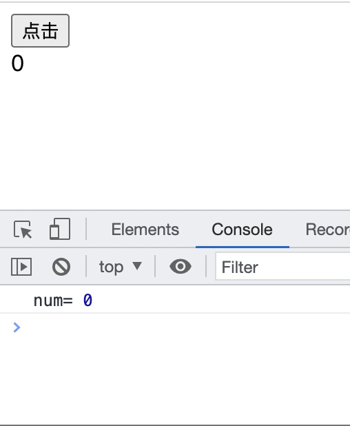

## 实现简易useState

这节是利用学习过的`hooks`相关知识，实现一个简易版的`useState`。  

这个使用原生实现的简易版的useState只具备触发状态更新和更新页面两个功能。

## 工作原理

```js
function App() {
    const [num, setNum] = useState(0);

    return <div onClick={() => setNum(n => n + 1)}>{num}</div>
}
```
以这段代码为例，根据`useState`实现的原理，我们知道`useState`分为声明阶段和调用阶段。

声明阶段是指`useState`在组件`mount`和`update`时会分别执行`mountState`和`updateReducer`。  

调用阶段是指调用`setNum`这个函数，然后而触发状态更新。  

## 声明阶段

因为`hooks`会区分`mount`和`update`，再调用属于对应阶段的方法。但是因为属于简易版的实现，我们用一个`useState`方法和一个变量`isMount`来模拟该过程。
```js
// 区分mount和update
let isMount = true;
// 创建fiber节点，用来保存hook和真实DOM节点
let fiber = {
    // 保存hook链表
    memoizedState: null,
    // 保存对应的DOM节点
    stateNode: App
}
// 当前正在执行的hook
let workInProgressHook = null;

const useState = (initialState) => {
    // 声明一个hook
    let hook;
    // 判断是mount还是update
    if (isMount) {
        // 如果是mount
        // 创建一个hook
        hook = {
            // 保存state
            memoizedState: initialState
            // 用来保存update链表
            queue: {
                pending: null
            },
            // 指针，用来指向下一个hook
            next: null
        };
        // 判断fiber.memoizedState是否有值
        if (!fiber.memoizedState) {
            // fiber.memoizedState为null，说明还没有hook
            // 刚创建的hook是第一个hook，保存在fiber.memoizedState
            fiber.memoizedState = hook;
        }else {
            // fiber.memoizedState有值，则不需要保存hook
            // 将创建的hook连接到workInProgressHook.next
            workInProgressHook.next = hook;
        }
    }else {
        // 如果是update
        // 不需要创建hook，直接使用workInProgressHook这个条hook链表
        hook = workInProgressHook;
        // 移动workInProgressHook
        workInProgressHook = workInProgressHook.next;
    } 
    // 赋值
    let basicState = hook.memoizedState;
    // 判断hook.queue.pending是否存在需要计算的update
    if (hook.queue.pending !== null) {
        // 计算update
        // 获取第一个update
        let update = hook.queue.pending.next;
        // 遍历这条环状链表
        do{
            // 获取action
            const action = update.action;
            // 判断action的类型，如果是函数类型，需要将state传入并执行后获取返回结果，否则是基础类型的值，直接保存
            basicState = typeof action === 'function' ? action(basicState) : action;
            // 移动update
            update = update.next;
        }while(update !== hook.queue.pending.next);
        // 清空hook.queue.pending
        hook.queue.pending = null; 
    }
    //赋值memoizedState
    hook.memoizedState = basicState;
    // 获取dispatch
    const dispatch = dispatchAction.bind(null, hook.queue);
    // 返回
    return [hook.memoizedState, dispatch];
}
```

## 调用阶段

调用阶段会调用`dispatchAction`方法，创建状态更新并开启调度更新。
```js
const dispatchAction = (queue, action) => {
    // 创建状态更新
    const update = {
        // action就是我们在调用setNum传入的回调函数
        action,
        // 指针，用于连接下一个update
        next: null
    };
    // 将update插入到queue.pending中
    if (queue.pending === null) {
        update.next = update;
    }else {
        update.next = queue.pending.next;
        queue.pending.next = update;
    }
    // queue.pending始终指向最后一个插入的update
    queue.pending = update;
    // 模拟开启调度更新
    run();
}
```
## 开启调度更新

因为主要目的是实现useState，所以开启调度更新这个方法只是为了让页面能够更新：
```js
function run() {
    //每次开启调度，都需要从fiber.memoizedState对应的第一个hook开始执行
    workInProgressHook = fiber.memoizedState;
    // 执行App方法，相当于更新组件
    const app = fiber.stateNode();
    // 赋值isMount，只有第一次是mount，之后都是update
    isMount = false;
    // 返回组App方法的执行结果
    return app;
}
```

## 页面结构

然后在例子上稍微改造一下，让我们可以通过一个按钮改变另一个节点的文本内容：
```js
    // 按钮用于触发点击事件
    <button id="btn">点击</button>
    // 显示变量的dom节点
    <div id="dom"></div>
    //获取dom元素
    const dom = document.getElementById('dom');
    const btn = document.getElementById('btn');
    // 模拟函数组件
    function App() {
        // 使用useState
        const [num, setNum] = useState(0);
        // 打印
        console.log('num', setNum);
        // 每次执行该组件时，都修改dom的文本内容，模拟dom节点的更新
        dom.innerHTML = num;
        // 定义一个onClick函数
        const onClick = () => {
            setNum(num => num + 1)
        }
        // 把这个函数返回出去
        return onClick;
    }
    // 获取onClick事件
    const event = run();
    // 将onClick事件绑定在button元素上，这样每次通过按钮的点击事件就可以触发setNum
    btn.addEventListener('click', () => event())
```

## 最终效果
最终显示在页面上的效果：
<div align=center>
  
</div>  