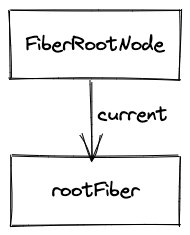
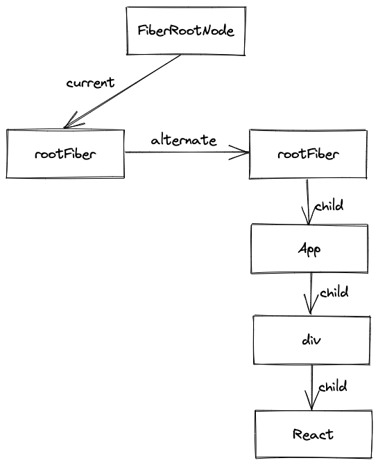
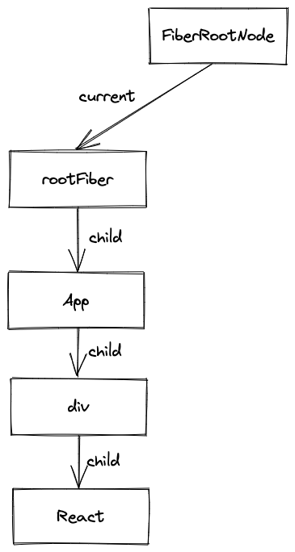
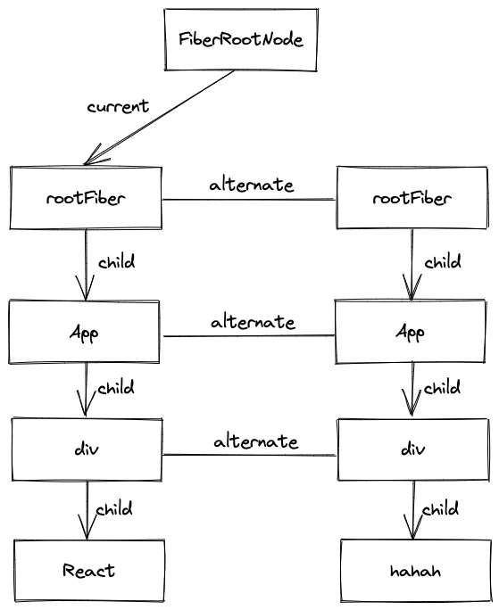
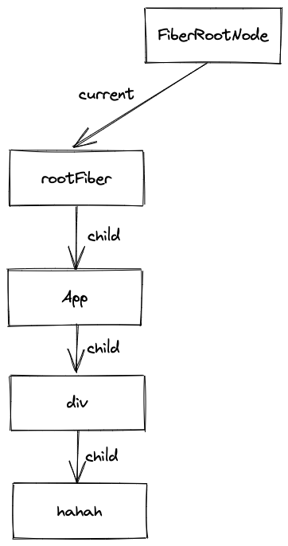

## Fiber结构的工作原理

我们知道`Fiber`节点可以保存对应的`DOM`节点，相应的，`Fiber`节点构成的`Fiber`树的结构也对应了`DOM`树。  
那么`React`是如何更新`DOM`的呢？`React`采用的是”*双缓存*“技术来更新`DOM`。

## 什么是“双缓存”

当使用`canvas`绘制动画，每一帧绘制都会调用`ctx.clearReact`清除上一帧的画面。  

如果当前帧画面计算量较大，导致清除上一帧画面到绘制当前帧画面之间有较长间隙，就会出现白屏。  

为了解决这个问题，可以在内存中绘制当前帧动画，绘制完毕之后直接用当前帧替换上一帧的画面，因为省去了两帧替换之间的时间，所以不会出现从白屏到出现画面的闪烁。  

这种在**内存中构建并直接替换**的技术叫*双缓存*。  

`React`就是使用“*双缓存*”来完成`Fiber树`的构建和替换，即对应的`DOM`树的生成和更新。

## 双缓存Fiber树

在`React`中最多会同时存在**两颗**`Fiber`树。当前在屏幕上显示的内容所对应的`Fiber`树就被称为`current Fiber`树，正在内存中构建的`Fiber`树就被称为`workInProgress Fiber`树。  

而`current Fiber`树中的`Fiber`节点被称为`current Fiber`。同样，`workInProgress Fiber`树中的`Fiber`节点被称为`workInProgress Fiber`。`current Fiber`往往和`workInProgress Fiber`有着一一对应的关系，这个关系是通过各自身上`alternate`属性连接的。
```js
function createWorkInProgress(current: Fiber, pendingProps: any): Fiber {
    // order code...
    
    // 通过alterbate属性连接
    workInProgress.alternate = current;
    current.alternate = workInProgress;
    // order code...
}
```
在`Reconciler`阶段，`beginWork`方法在`update`逻辑时创建`workInProgress Fiber`节点时都会调用`createWorkInProgress`方法复用`current Fiber`节点，同时`createWorkInProgress`方法内部还会为`current Fiber`节点和`workInProgress Fiber`产生关联。  

`React`应用的根节点通过使`current`指针在不同`Fiber`树的`rootFiber`间切换来完成`current Fiber`树指向的切换。  

即当`workInProgress Fiber`树构建完成后进入`Renderer`（渲染器）渲染到页面上，应用根节点的`current`指针就指向`workInProgress Fiber`树，此时`workInProgress Fiber`树就顺利变为`current Fiber`树。每次状态更新都会产生新的`workInProgress Fiber`树，通过`current`与`workInProgress`的替换，来完成`DOM`的更新。  

接下来通过以下具体的例子了解下`mount`和`update`分别对应`Fiber`树的构建和替换的过程。
```js
function App() {
    const [name, setName] = useState('React')

    return (
        <p onClick={() => setName('hahah')}>{name}</p>
    )
}
```
### mount
以上述代码为例，在首屏渲染时，对应的`current Fiber`树结构是：  
<div align=center></div>

其中`FiberRootNode`是整个应用的根节点，这个根节点通常就是`div#root`。而`rootFiber`是通过`ReactDOM.create/ReactDOM.render`创建的根`Fiber`节点。  

`FiberRootNode`的`current`指针会指向当前页面上已渲染内容对应`Fiber`树，即`current Fiber`树。

```js
fiberRootNode.current = rootFiber;
```
由于是首屏渲染，页面中还没有挂载任何`DOM`，所以`rootFiber`下没有任何子`Fiber`节点，即当前`current Fiber`树为空。  

接着会进入`render`阶段，根据组件返回的`React Element`会创建对应的`Fiber`节点，并将创建的`Fiber`节点通过`child`指针连接起来，一起构成`Fiber`树。这棵树就是`workInProgress Fiber`树。并且，在构建`workInProgress Fiber`树时会尝试复用`current Fiber`树中对应的`Fiber`节点的内在属性。对应`workInProgress Fiber`树是：
<div align=center></div>

当`workInProgress Fiber`树经过`render`阶段的创建完成后，会在`commit`阶段渲染到页面上。
<div align=center></div>

### update
当点击`p`节点触发状态更新时，会开启一次状态更新流程，即进入`render`阶段开始构建一颗新的`workInProgress Fiber`树。
<div align=center></div>

和`mount`时一样，`workInProgress Fiber`的创建可以复用`current Fiber`树对应的节点数据。
当`workInProgress Fiber`树在`render`阶段完成构建后进入`commit`阶段渲染到页面上。渲染完毕后，`workInProgress Fiber`树又会变为`current Fiber`树。
<div align=center></div>  

## 总结

本文介绍了`Fiber`树会通过先构建`workInProgress Fiber`树然后替换页面上显示的`current Fiber`树的方式工作，这种被称为"*双缓存*"技术实现`DOM`的更新了。  

其中创建`Fiber`节点的过程被称为`render`阶段，会在[Reconciler](../architecture/reconciler.md)介绍。

