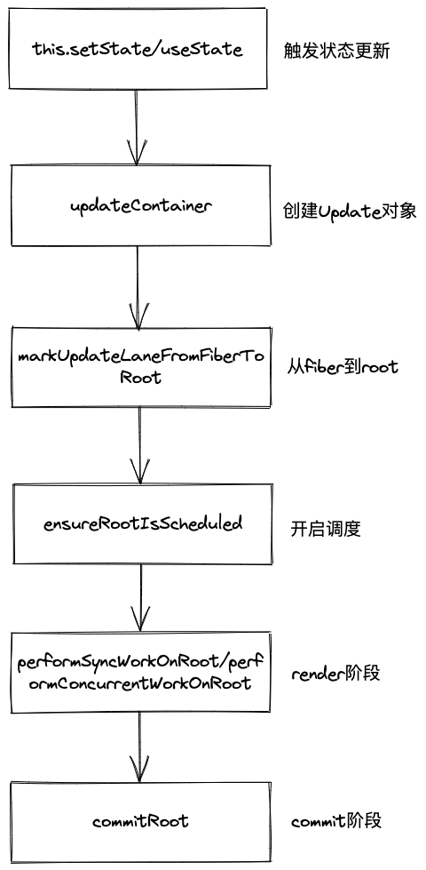

## React工作流程

`React`的工作流程就是状态更新的过程。状态更新的调用路径的关键节点：
<div align=center>
  
</div>  

## 触发状态更新

目前，React中比较常用的可以触发状态更新的方法：  
+ ReactDOM.render
+ ReactDOM.createRoot().render()
+ this.setState
+ useState
+ useReducer

这方法在每次调用的时候都会调用`updateContainer`方法创建一个`Update`对象，这个`Update`对象会保存**更新状态相关的内容**。在`render`阶段中的`beginWork`中会根据`Update`计算新的`state`。

## 创建Update对象

```js
function updateContainer(
  element: ReactNodeList,
  container: OpaqueRoot,
  parentComponent: ?React$Component<any, any>,
  callback: ?Function,
): Lane {
  const current = container.current;
  const eventTime = requestEventTime();
  const lane = requestUpdateLane(current);

  // 调用createUpdate方法
  // const Update = createUpdate(eventTime, lane)
  const update = {
    eventTime,
    lane,

    tag: UpdateState,
    payload: null,
    callback: null,

    next: null,
  };
  // Caution: React DevTools currently depends on this property
  // being called "element".
  update.payload = {element};

  callback = callback === undefined ? null : callback;
  if (callback !== null) {
    update.callback = callback;
  }
  // 将创建的update插入到fiber.UpdateQueue属性中
  // 多个update通过环状链表的数据结构保存
  enqueueUpdate(current, update, lane);
  // 开启调度更新
  const root = scheduleUpdateOnFiber(current, lane, eventTime);
  if (root !== null) {
    entangleTransitions(root, current, lane);
  }

  return lane;
}
```

## 从fiber到rootFiber

该过程会调用`markUpdateLaneFromFiberToRoot`方法向上遍历，直到遍历到`rootFiber`根节点。
```js
function markUpdateLaneFromFiberToRoot(
  sourceFiber: Fiber,
  lane: Lane,
): FiberRoot | null {
  // order code...

  // 从目标节点，根据return属性一直向上遍历到rootFiber
  let node = sourceFiber;
  let parent = sourceFiber.return;
  while (parent !== null) {
    node = parent;
    parent = parent.return;
  }
  if (node.tag === HostRoot) {
    const root: FiberRoot = node.stateNode;
    return root;
  } else {
    return null;
  }
}
```

## 调度更新

在`scheduleUpdateOnFiber`函数的内部会调用`ensureRootIsScheduled`方法。  
`ensureRootIsScheduled`的核心代码：
```js
  if (newCallbackPriority === SyncLane) {
    // 通过同步的优先级，同步执行render阶段
    scheduleSyncCallback(performSyncWorkOnRoot.bind(null, root));
  } else {
    // 通常以normal优先级，异步执行render阶段
    let schedulerPriorityLevel = NormalSchedulerPriority;
    newCallbackNode = scheduleCallback(
      schedulerPriorityLevel,
      performConcurrentWorkOnRoot.bind(null, root),
    );
  }
```

## render阶段

整个render阶段又分为两个子阶段”递阶段“和”归阶段“。分别调用的方法是`beginWork`和`completeWork`。  

render阶段会从应用的根节点`FiberRootNode`开始向下进行深度优先遍历，为每个`Fiber节点`调用`beginWork`方法，直到第一个`叶子节点`。  

"递阶段"的工作是根据遍历到的`Fiber节点`生成它的`子Fiber节点`，并将`两个Fiber节点`连接起来，形成`Fiber树`。当遍历到`叶子节点`时，就会进入"归阶段"。  

"归阶段"的工作是为遍历到的`Fiber节点`生成对应的真实`DOM节点`，并将`Fiber节点`和`DOM节点`产生对应关系。如果当前的`Fiber节点`存在`兄弟Fiber节点`，
就会进入`兄弟Fiber节点`的”递阶段“。如果不存在`兄弟Fiber节点`，就会进入`父级Fibe节点`的”归阶段“，递和归交错进行，直到归到`FiberRootNode`。  
在"归阶段"当中，还会调用`appendAllChildren`方法，将生成的真实`DOM节点`插入到已生成的`DOM节点`中，这样工作到根节点时，就已经形成了一棵构建好完整的`离屏DOM树`。

最终，在`performConcurrentWorkOnRoot`方法中会调用`commit阶段`的入口函数`commitRoot`

## commit阶段

`commit`阶段的主要工作（即`Renderer`的工作流程）分为三部分：
+ `before mutation`阶段（执行DOM操作前）
+ `mutation`阶段（执行DOM操作）
+ `layout`（执行DOM操作后）
在`before mutation阶段`之前和`layout阶段`之后还有一些额外的工作。涉及`useEffect的触发`、优先级的重置和`ref`的绑定/解绑。  

`before mutation`阶段的主要工作：
1. 处理DOM节点渲染或删除后的`autofocus`、`blur`的逻辑
2. 对于`ClassComponent`，调用`getSnapShotBeforeUpdate`生命周期函数

`mutation`阶段的主要工作：
1. 根据`ContentReset flags`重置文本节点
2. 更新`ref`
3. 根据`flags`分别做不同的处理，包括：执行`DOM`节点的插入，更新`DOM`节点的属性，删除`DOM`节点

`layout`阶段的主要工作：
1. 根据`fiber.tag`分别做不同的处理，对于`FunctionComponent`，调用`useLayoutEffect`的回调函数，对于`ClassComponent`，判断`current`是否为`null`，`mount`时调用`componentDidMount`，`update`时调用`componentDidUpdate`
2. 执行回调函数，对于`ClassComponent`，执行`this.setState`的第二个参数回调函数，对于`HostRoot`，执行`ReactDOM.render`的第三个参数回调函数
3. 赋值`ref` 
