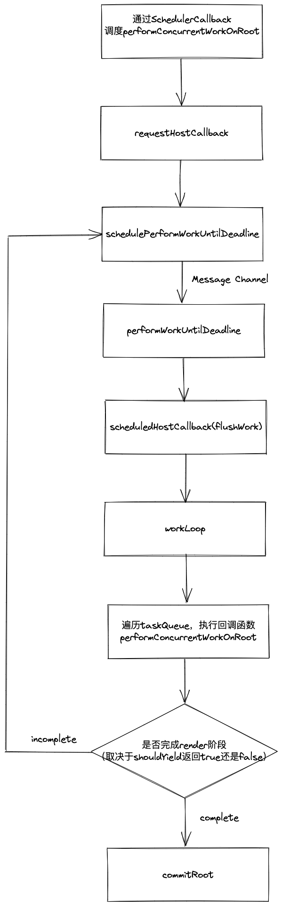

## Scheduler的工作流程

在`scheduler`的架构篇主要介绍的是`Scheduler`实现的原理或者说理念。而这节是为了把整个`Scheduler`的工作流程串联起来，为了能更好的理解`Scheduler`是如何工作的。  

时间切片的具体代码如下：
```js
let performWorkUntilDeadline = null;
let schedulePerformWorkUntilDeadline;
if (typeof localSetImmediate === 'function') {
  // Node.js和老版ie会使用setImmediate实现时间切片
  schedulePerformWorkUntilDeadline = () => {
    localSetImmediate(performWorkUntilDeadline);
  };
} else if (typeof MessageChannel !== 'undefined') {
  // DOM和worker环境会使用MessageChannel实现时间切片
  const channel = new MessageChannel();
  const port = channel.port2;
  channel.port1.onmessage = performWorkUntilDeadline;
  schedulePerformWorkUntilDeadline = () => {
    port.postMessage(null);
  };
} else {
  // 降级使用setTimeout
  schedulePerformWorkUntilDeadline = () => {
    localSetTimeout(performWorkUntilDeadline, 0);
  };
}

// 初始时间 5ms
let yieldInterval = 5; 
// 最后期限
let deadline = 0;
const performWorkUntilDeadline = () => {
  if (scheduledHostCallback !== null) {
    const currentTime = getCurrentTime();
    // 不断增加deadline的值
    deadline = currentTime + yieldInterval;
    const hasTimeRemaining = true;

    // hasMoreWork表示是否有未完成的task，即任务的暂停
    let hasMoreWork = true;
    try {
        // scheduledHostCallback就是lushWork方法，等价于执行flushWork方法
        hasMoreWork = scheduledHostCallback(hasTimeRemaining, currentTime);
    } finally {
        // 如果存在未完成的task，则继续调用
        if (hasMoreWork) {
            schedulePerformWorkUntilDeadline();
        } else {
            isMessageLoopRunning = false;
            scheduledHostCallback = null;
        }
    }
  } else {
    isMessageLoopRunning = false;
  }
};
```
这段代码主要做的工作是通过`Message Channel`创建了两个端口，`port1.postMessage`放在`schedulePerformWorkUntilDeadline`方法中，而`port2.onmessage`赋值为`performWorkUntilDeadline`方法。  

这样当调用`schedulePerformWorkUntilDeadline`方法的时候，会执行`port1.postMessage`方法，然后触发`port2.onmessage`即`performWorkUntilDeadline`。  
`performWorkUntilDeadline`方法的主要工作是调用`scheduledHostCallback`方法。那`scheduledHostCallback`是在哪里定义的呢？  

如代码所示：
```js
// 全局变量
let isMessageLoopRunning = false;
let scheduledHostCallback = null;

function requestHostCallback(callback) {
  // 赋值scheduledHostCallback
  scheduledHostCallback = callback;
  if (!isMessageLoopRunning) {
    isMessageLoopRunning = true;
    schedulePerformWorkUntilDeadline();
  }
}

function flushWork(hasTimeRemaining, initialTime) {
  // isHostCallbackScheduled是一个全局变量，表示是否有正在调度的回调函数
  isHostCallbackScheduled = false;
  if (isHostTimeoutScheduled) {
    // We scheduled a timeout but it's no longer needed. Cancel it.
    isHostTimeoutScheduled = false;
    cancelHostTimeout();
  }

  isPerformingWork = true;
  const previousPriorityLevel = currentPriorityLevel;
  try {
    // 执行workLoop方法，即遍历taskQueue，执行回调函数
    return workLoop(hasTimeRemaining, initialTime);
  } finally {
    // 重置优先级
    currentTask = null;
    currentPriorityLevel = previousPriorityLevel;
    isPerformingWork = false;
    if (enableProfiling) {
      const currentTime = getCurrentTime();
      markSchedulerSuspended(currentTime);
    }
  }
}
```
从这段代码可以看到，调用`requestHostCallback`方法是，会将第一个参数赋值给`scheduledHostCallback`变量，而这个参数就是`flushWork`函数。当前如果没有正在进行的任务则会调用`schedulePerformWorkUntilDeadline`方法。  

以上这些代码的起始方法是`requestHostCallback`，然后通过`Message Channel`两个端口的链接执行`performWorkUntilDeadline`方法，最终调用`scheduledHostCallback`方法即`flushWork`。  
<!-- 目前我们已经将`Message Channel`做的工作了解清楚了，在`Scheduler`中扮演的相当于一个开关角色，决定了是否调用`workLoop`方法遍历`taskQueue`和执行回调函数。`Message Channel`是判断当前时间片是否用尽，即当前帧是否有剩余时间。如果有时间就调用`workLoop`方法执行`taskQueue`中的回调函数，如果没有时间就停止执行`workLoop`，等到下一帧再执行。那么这个回调函数和`taskQueue`是怎么定义的呢？ -->

如代码所示：
```js
var maxSigned31BitInt = 1073741823;
// Times out immediately
var IMMEDIATE_PRIORITY_TIMEOUT = -1;
// Eventually times out
var USER_BLOCKING_PRIORITY_TIMEOUT = 250;
var NORMAL_PRIORITY_TIMEOUT = 5000;
var LOW_PRIORITY_TIMEOUT = 10000;
// Never times out
var IDLE_PRIORITY_TIMEOUT = maxSigned31BitInt;

// 获取当前时间
let getCurrentTime;
if (hasPerformanceNow) {
  const localPerformance = performance;
  getCurrentTime = () => localPerformance.now();
} 

function unstable_scheduleCallback(priorityLevel, callback, options) {
    // 获取当前时间
    var currentTime = getCurrentTime();
    // 定义开始时间
    var startTime;
    if (typeof options === 'object' && options !== null) {
        var delay = options.delay;
        if (typeof delay === 'number' && delay > 0) {
        startTime = currentTime + delay;
        } else {
        startTime = currentTime;
        }
    } else {
        // 通常开始时间等于当前时间
        startTime = currentTime;
    }
    // 优先级会转化为延迟时间的长短
    var timeout;
    switch (priorityLevel) {
        case ImmediatePriority:
            timeout = IMMEDIATE_PRIORITY_TIMEOUT;
            break;
        case UserBlockingPriority:
            timeout = USER_BLOCKING_PRIORITY_TIMEOUT;
            break;
        case IdlePriority:
            timeout = IDLE_PRIORITY_TIMEOUT;
            break;
        case LowPriority:
            timeout = LOW_PRIORITY_TIMEOUT;
            break;
        case NormalPriority:
        default:
            timeout = NORMAL_PRIORITY_TIMEOUT;
            break;
    }
    // 过期时间
    // 优先级越高, 过期时间越短，优先级越低,过期时间越长
    var expirationTime = startTime + timeout;
    // 初始化任务
    var newTask = {
        id: taskIdCounter++, // 任务id
        callback,   // 传入的回调函数
        priorityLevel,  // 当前回调函数的优先级
        startTime,  // 回调函数的开始时间
        expirationTime, // 回调函数的过期时间
        sortIndex: -1,
    };
    // 开始时间大于当前时间，说明传入了delay延迟时间，newTask未过期，将newTask保存到timerQueue
    if (startTime > currentTime) {
        // This is a delayed task.
        newTask.sortIndex = startTime;
        push(timerQueue, newTask);
        // taskQueue队列中没有过期的任务，并且newTask是timerQueue队列中第一个未过期的任务
        if (peek(taskQueue) === null && newTask === peek(timerQueue)) {
            // 当前是否有正在调度的定时器
            if (isHostTimeoutScheduled) {
                // 取消当前的定时器
                cancelHostTimeout();
            } else {
                isHostTimeoutScheduled = true;
            }
            // 设置一个定时器，到时间执行advanceTimers（将timerQueue中即将过期的任务放到taskQueue）
            requestHostTimeout(handleTimeout, startTime - currentTime);
        }
    } else {
    // 开始时间等于当前时间，说明newTask过期了，将newTask保存到taskQueue
        newTask.sortIndex = expirationTime;
        push(taskQueue, newTask);
        // 当前没有正在调度的回调函数，则最终调用workLoop执行taskQueue中过期的任务
        if (!isHostCallbackScheduled && !isPerformingWork) {
            isHostCallbackScheduled = true;
            requestHostCallback(flushWork);
        }
    }

    return newTask;
}
```
这段代码就是`Scheduler`阶段的入口函数`scheduleCallback`。将传入的两个参数`callback`通过`priorityLevel`初始化`开始时间`和`过期时间`。  

优先级就对应**任务过期时间的长短**，优先级越高任务**过期的越快**，优先级越低任务**过期的越慢**。然后比较开始时间和当前时间的大小，如果开始时间大于当前时间说明该`task`未过期，未过期的任务就被保存在`timerQueue`（*未过期*任务队列）中。如果开始时间小于等于当前时间说明该`task`过期了，过期的任务被保存在`taskQueue`（*过期*任务队列）中。  

其中`timerQueue`和`taskQueue`使用的数据结构是*小顶堆*，而小顶堆是一颗**完全二叉树**，根据**过期时间**排序，堆顶的那个元素一定是**最快过期**（在timerQueue中）的和**过期时间最久**（在taskQueue中）的。通过`peek`方法可以查看堆顶的元素、`pop`方法可以从队列弹出任务、`push`方法可以向队列插入任务。*小顶堆*和操作*小顶堆*的方法都是`Scheduler`包内部实现和提供的。  

通过`taskQueue`和`timerQueue`两个队列我们就能清楚的知道哪些任务过期了需要立刻执行。而没有过期就需要提前设置定时器，等到了定时时间就从`timerQueue`中取出过期的任务放到`taskQueue`中。从`timerQueue`取出过期的任务放到`taskQueue`的工作是通过`advanceTimers`方法完成的。  

如代码所示：
```js
function advanceTimers(currentTime) {
  // 查看timerQueue中的第一个任务
  let timer = peek(timerQueue);
  // 循环读取timerQueue中的任务
  while (timer !== null) {
    // 这个任务没有callback就
    if (timer.callback === null) {
        // 直接弹出，清除掉
        pop(timerQueue);
    } else if (timer.startTime <= currentTime) {
        // 开始时间小于当前时间，说明过期了 
        // 从timerQueue中弹出
        pop(timerQueue);
        timer.sortIndex = timer.expirationTime;
        // 推进taskQueue中
        push(taskQueue, timer);
    } else {
        // 其他就是未过期的任务
        return;
    }
    timer = peek(timerQueue);
  }
}
```
既然已经我们已经了解了操作`timerQueue`的方法，那操作`taskQueue`的方法是什么呢？其实在上文中已经提到过了，就是`workLoop`方法。但是`workLoop`方法会在`flushWork`函数内部调用，所以放在一起看一下。  
如代码所示：
```js
function flushWork(hasTimeRemaining, initialTime) {

    isHostCallbackScheduled = false;
    // 存在调度的回调函数，则取消它
    if (isHostTimeoutScheduled) {
        isHostTimeoutScheduled = false;
        cancelHostTimeout();
    }

    isPerformingWork = true;
    const previousPriorityLevel = currentPriorityLevel;
    try {
        // 执行workLoop
        return workLoop(hasTimeRemaining, initialTime);
    } finally {
        // 重置变量
        currentTask = null;
        currentPriorityLevel = previousPriorityLevel;
        isPerformingWork = false;
    }
}

function workLoop(hasTimeRemaining, initialTime) {
    // 当前时间
    let currentTime = initialTime;
    // 查看timerQueue有没有过期task
    advanceTimers(currentTime);
    // 取出taskQueue中过期最久的task
    currentTask = peek(taskQueue);
    while (
        currentTask !== null
    ) {
        // task的过期时间是否大于当前时间，并且当前有没有剩余时间 或者 应该让出主线程
        if (
            currentTask.expirationTime > currentTime &&
            (!hasTimeRemaining || shouldYieldToHost())
        ) {
            break;
        }
        // 
        const callback = currentTask.callback;
        // 判断callback的类型
        if (typeof callback === 'function') {
            // 如果callback是函数类型
            currentTask.callback = null;
            // 取到这个task的优先级
            currentPriorityLevel = currentTask.priorityLevel;
            const didUserCallbackTimeout = currentTask.expirationTime <= currentTime;
            // 执行callback，并获取执行结果
            const continuationCallback = callback(didUserCallbackTimeout);
            currentTime = getCurrentTime();
            // callback的返回值如果还是一个函数
            if (typeof continuationCallback === 'function') {
                // 将返回值的函数再赋值给callback，等待继续执行
                currentTask.callback = continuationCallback;
            } else {
            // 如果不是一个函数，通常为null，则说callback明彻底执行完了，将task弹出，清除掉
                if (currentTask === peek(taskQueue)) {
                    pop(taskQueue);
                }
            }
            // 继续取出timerQueue即将过期的task
            advanceTimers(currentTime);
        } else {
            // 如果callback不是一个函数则直接清除掉
            pop(taskQueue);
        }
        // 重新取出taskQueue中过期的任务，继续执行回调函数
        currentTask = peek(taskQueue);
    }
    // 可能存在未执行完的task
    if (currentTask !== null) {
        // 返回的true，会赋值给hasMoreTask，将开启新一轮workLoop
        return true;
    } else {
        // 取出timerQueue中的第一个未过期的任务
        const firstTimer = peek(timerQueue);
        // timerQueue存在未过期的任务
        if (firstTimer !== null) {
            // 设置定时器，到时间执行advanceTimers方法，将未过期的任务放到taskQueue并执行
            requestHostTimeout(handleTimeout, firstTimer.startTime - currentTime);
        }
        // 返回false，表示taskqueue中过期的任务都已经执行完了
        return false;
    }
}
```
从这段断码可以看出，`workLoop`的主要工作就是遍历`taskQueue`取出过期的`task`，然后执行`callback`属性。  

其中比较重要的一行代码就是：
```js
 if (
    currentTask.expirationTime > currentTime &&
    (!hasTimeRemaining || shouldYieldToHost())
) {
    break;
}
```
虽然当前的`task`的过期时间大于当前时间，说明这个任务还没有过期。但是如果当前时间片有剩余时间或者不应该让出主线程即`shouldYieldToHost`方法的返回值为`false`，同样会执行`task`的`callback`函数。所以`task`的过期时间并不表示准确的执行时机，它更多决定了多个`task`之间相对的执行顺序。  

所以虽然某个`task`还没有完全过期，但是如果当前帧有剩余时间，也会提前执行它。  

## 总结

Scheduler大致流程图：  
<!-- <div align=center></div>   -->
<div align=center>
  
</div>  
