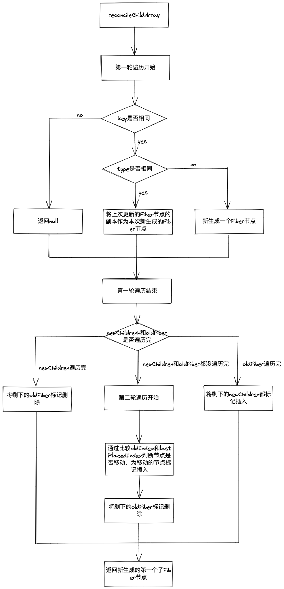

## Diff算法

经过`reconciler`一节有关`beginWork`方法的学习，我们知道对于`update`的组件，会通过`reconcileChildFibers`方法将当前组件与该组件在上次更新时对应的`Fiber`节点比较（俗称即`diff`算法），将比较的结果生成新的`Fiber`节点。
在此之前需要明确一下，在某一时刻，一个`DOM`节点最多会存在**4个节点**与它有关：
::: tip
+ `current Fiber`，代表在页面中`DOM`节点对应的`Fiber`节点。
+ `workInProgress Fiber`，代表在内存中正在构建的`Fiber`节点。
+ `DOM`节点本身。
+ `JSX`对象，即`ClassComponent`的`render`方法的返回值，或`FunctionComponent`的`return`的返回值。`JSX`中包含了描述`DOM`节点的信息。
:::
那么`diff`算法的本质就是对比**1和4，然后生成2**。  

### Diff的瓶颈以及React如何应对
由于`diff`操作本身也会带来**性能损耗**，`React`文档的说法，即时在最前沿的算法中，将前后两棵树完全比对的算法的复杂度为*O(n 3 )*，其中*n*是树中元素的数量。  
如果在`React`中使用了该算法，那么展示*1000*个元素所要执行的计算量级将在**十亿**的量级范围，这个开销实在太大。  
所以为了降低算法复杂度，`React`的`diff`会预设三个限制：
+ 只对同级元素进行`Diff`。如果一个`DOM`节点在前后两次更新中跨越了层级，那么`Diff`并不会尝试复用它
+ 两个不同类型的元素会产生出不同的树。如果前后一个元素的类型由div变为p，那么`React`会销毁`div`及其子孙节点，并新建`p`及其子孙节点
+ 开发者可以使用`key`属性标识哪些子元素在不同的渲染中可能是不变的。 

## Diff的实现

我们从`diff`的入口函数`reconcileChildFibers`开始，该函数会根据`newChild`类型调用不同的处理函数。
```js
// 根据newChild类型选择不同diff函数处理
function reconcileChildFibers(
  returnFiber: Fiber,
  currentFirstChild: Fiber | null,
  newChild: any,
): Fiber | null {
    // 传入的newChild是对象类型
    if (typeof newChild === 'object' && newChild !== null) {
        switch (newChild.$$typeof) {
            // React Element
            case REACT_ELEMENT_TYPE:
            return placeSingleChild(
                // 进行单节点的diff
                reconcileSingleElement(
                    returnFiber,
                    currentFirstChild,
                    newChild,
                    lanes,
                ),
            );
        }
        // newChild是一个数组，说明存在多个子节点
        if (isArray(newChild)) {
            // 进行多节点的diff
            return reconcileChildrenArray(
                returnFiber,
                currentFirstChild,
                newChild,
                lanes,
            );
        }
    }
    // 传入的newChild是文本类型
    if (typeof newChild === 'string' || typeof newChild === 'number') {
        return placeSingleChild(
            // 处理单个文本子节点
            reconcileSingleTextNode(
                returnFiber,
                currentFirstChild,
                '' + newChild,
                lanes,
            ),
        );
    }
    // 以上都没有命中，删除子节点
    return deleteRemainingChildren(returnFiber, currentFirstChild);
}
```
从代码中可以看到，对于同级的节点会分成两类进行处理：
+ 当`newChild`类型为`Object、number、string`，代表同级只有一个节点
+ 当`newChild`类型为`Array`，代表同级有多个节点  

所以整个`Diff`算法也主要会分两种处理方式：**单节点的Diff**和**多节点的Diff**。

## 单节点Diff

如果`newChild`是`object`类型，就会进入`reconcileSingleElement`方法。
```js
function reconcileSingleElement(
    returnFiber: Fiber,
    currentFirstChild: Fiber | null,
    element: ReactElement,
    lanes: Lanes,
  ): Fiber {
    // 属性key
    const key = element.key;
    // 当前第一个子current Fiber节点
    let child = currentFirstChild;
    while (child !== null) {
        // current Fiber节点的属性key和JSX对象的属性key进行比较
      if (child.key === key) {
        // 获取JSX对象的类型type
        const elementType = element.type;
        if (elementType === REACT_FRAGMENT_TYPE) {
          // 处理fragment节点
        } else {
            // current Fiber节点的属性type和JSX对象的属性type进行比较
          if (
            child.elementType === elementType
          ) {
            // 如果两者的key和type都相同，代表workInProgress Fiber的创建过程可以复用对应的current Fiber节点的部分属性

            // 因为本次是单节点的diff，说明当前只存在一个子节点，所以需要将current Fiber子节点的兄弟节点都标记为删除
            deleteRemainingChildren(returnFiber, child.sibling);
            // useFiber方法就是根据current Fiber节点的部分属性，然后创建workInProgress Fiber节点
            const existing = useFiber(child, element.props);
            existing.ref = coerceRef(returnFiber, child, element);
            // 将创建的workInProgress Fiber节点的return指针指向父级Fiber节点，构成fiber树
            existing.return = returnFiber;
            // 返回创建的workInProgress Fiber节点
            return existing;
          }
        }
        // 没有进入上面的判断，那么current Fiber节点的key和JSX对象的key相同，但是type不同，说明不能复用current Fiber节点，需要重新创建workInProgress Fiber节点
        // 因为当前只存在一个子节点，所以需要将current Fiber子节点的兄弟节点都标记为删除
        deleteRemainingChildren(returnFiber, child);
        break;
      } else {
        // 当current Fiber节点的key和JSX对象的key不同，说明不能复用current Fiber节点
        // 但是因为当前的current Fiber节点可能存在兄弟Fiber节点，那么我们还需要遍历其他的兄弟Fiber节点来进行key和type的判断
        // 所以在这里我们只为当前的current Fiber节点标记删除
        deleteChild(returnFiber, child);
      }
      // 移动循环的指针
      child = child.sibling;
    }

    if (element.type === REACT_FRAGMENT_TYPE) {
        // 处理fragment节点
    } else {
      // 通过判断，没办法复用current Fiber节点，就需要调用createFiberFromElement方法创建一个workInProgress Fiber节点
      const created = createFiberFromElement(element, returnFiber.mode, lanes);
      created.ref = coerceRef(returnFiber, currentFirstChild, element);
      // 将创建的workInProgress Fiber节点的return指针指向父级Fiber节点，构成fiber树
      created.return = returnFiber;
      // 返回创建的workInProgress Fiber节点
      return created;
    }
  }
```
从这段代码可以看出，`React`通过先判断`key`是否相同，如果`key`相同才会继续判断`type`是否相同，只用两者都相同时，一个`Fiber`节点才能进行复用。  
这里有个细节需要关注下：
+ 当`child !== null`，`key`相同且`type`不同时执行`deleteRemainingChildren`将`child`及其兄弟`fiber`都标记删除。
+ 当`child !== null`，`key`不同时仅将`child`标记删除。  

举个例子：
```js
// 更新前
<ul>
    <li></li>
    <li></li>
    <li></li>
</ul>

// 更新后
<ul>
    <p></p>
</ul>
```
由于本次更新时只有一个*p*节点，属于单一节点的`diff`，所以进入上面代码的逻辑。通过遍历3个*li*对应的`Fiber`节点，会寻找本次更新的`DOM`节点*p*是否可以复用之前的3个`li`对应的`Fiber`节点。  

当`key`相同但`type`不同时，代表已经找到了本次更新的*p*对应的上次的`Fiber`节点，但是*p*和*li*的`type`不同，所以不能复用。既然唯一的可能性都不能复用，那么剩下的`Fiber`节点都没有复用的可能了，所以需要将剩下的`Fiber`节点都标记删除。  
另一种情况，当`key`不同时，代表本次遍历的`Fiber`节点不能被*p*节点复用，但是后面还有兄弟`Fiber`节点没有被遍历到，所以后面可能存在可以复用的`Fiber`节点，所以只需要将当前的`Fiber`节点标记删除。  

单节点diff流程图：  
<div align=center>
  
</div>  

## 多节点diff  

多节点可能出现的情况大致有三种：节点更新、节点新增或减少和节点位置变化。  

### Diff的思路
普通情况下，通常首先会判断当前节点的更新属于哪种情况：
+ 如果是新增，则执行新增的逻辑
+ 如果是删除，则执行删除的逻辑
+ 如果是更新，则执行更新的逻辑  

按这个方案，其实有个隐含的前提————不同操作的优先级是相同的。  
但是React团队发现，在日常开发中，相较于新增和删除，更新组件发生的频率是更高的。所以diff会优先判断当前节点是否属于更新的情况。  
::: tip
在做数组相关的算法时，经常会使用双指针从数组头部和尾部同时遍历以提高执行效率，但是多节点`diff`却不适用。  
虽然本次更新的`JSX`对象对应的`newChildren`为数组的形式，但是和`newChildren`中的元素进行比较的`current Fiber`节点，同级的`current Fiber`节点是通过`sibling`指针连接形成的单向链表，所以不支持双指针的遍历方式。  
所以多节点diff无法使用双指针优化。
:::
基于以上原因，`diff`算法的整体逻辑会经历两轮遍历：
+ 第一轮遍历，处理更新的节点
+ 第二轮遍历，处理剩下不属于更新的节点  

### 第一轮遍历
```js
 function reconcileChildrenArray(
    returnFiber: Fiber,
    currentFirstChild: Fiber | null,
    newChildren: Array<*>,
    lanes: Lanes,
  ): Fiber | null {
    // 最后结果返回的第一个子Fiber节点
    let resultingFirstChild: Fiber | null = null;
    // 中间变量，负责连接前后两个Fiber节点
    let previousNewFiber: Fiber | null = null;
    // 对应的第一个current Fiber节点
    let oldFiber = currentFirstChild;
    // 遍历到的最后一个可复用current Fiber节点对应的index索引
    let lastPlacedIndex = 0;
    // 遍历newChildren数组元素的index索引
    let newIdx = 0;
    // 中间变量，遍历到的下一个current Fiber节点
    let nextOldFiber = null;
    // 第一轮遍历
    // 遍历newChildren数组
    for (; oldFiber !== null && newIdx < newChildren.length; newIdx++) {
      //比较oldFiber的index和newIdx
      if (oldFiber.index > newIdx) {
        nextOldFiber = oldFiber;
        oldFiber = null;
      } else {
        nextOldFiber = oldFiber.sibling;
      }
      // updateSlot内部会通过key和type判断是否可以复用current Fiber节点
      // 如果key相同和type都相同，则会复用current Fiber节点来创建workInProgress Fiber节点
      // 如果key相同type不同，则会重新创建一个workInProgress Fiber节点
      // 如果key不同，则会直接返回null
      const newFiber = updateSlot(
        returnFiber,
        oldFiber,
        newChildren[newIdx],
        lanes,
      );
      if (newFiber === null) {
        if (oldFiber === null) {
          oldFiber = nextOldFiber;
        }
        // 当key不同，不能复用节点则会直接跳出第一轮遍历
        break;
      }
      // update时，shouldTrackSideEffects为true
      if (shouldTrackSideEffects) {
        // current Fiber存在，但生成的workInProgress Fiber的alternate为空，说明这个workInProgress Fiber节点是新建的，即key相同但type不同
        if (oldFiber && newFiber.alternate === null) {
          // 将current Fiber节点标记删除
          deleteChild(returnFiber, oldFiber);
        }
      }
      // placeChild方法是多节点diff最精髓也是最难理解的部分，会在后面讲解
      lastPlacedIndex = placeChild(newFiber, lastPlacedIndex, newIdx);
      // previousNewFiber为空
      if (previousNewFiber === null) {
        // 说明newFiber是当前的第一个子Fiber节点，需要作为结果返回
        resultingFirstChild = newFiber;
      } else {
        // 通过previousNewFiber作为中间变量，以sibling来连接前后两个兄弟Fiber节点
        previousNewFiber.sibling = newFiber;
      }
      // 重新赋值变量
      previousNewFiber = newFiber;
      oldFiber = nextOldFiber;
    }

    // order code...
}
```
从这段代码可以看出，在第一轮遍历时，会有两种结束遍历的可能：
+ 当`key`不同导致不可复用时，会立即跳出遍历循环，第一轮遍历结束。
+ 当`newChildren`全部遍历完，第一轮遍历结束。  

当结束第一轮遍历时，可能出现以下4种情况：
+ 情况1：newChildren和oldFiber同时遍历完
+ 情况2：newChildren没遍历完，oldFiber遍历完
+ 情况3：newChildren遍历完，oldFiber没遍历完
+ 情况4：newChildren和oldFiber都没有遍历完  

我们可以看下处理后续结果的代码：
```js
 function reconcileChildrenArray(
    returnFiber: Fiber,
    currentFirstChild: Fiber | null,
    newChildren: Array<*>,
    lanes: Lanes,
  ): Fiber | null {
    // 第一轮遍历...
    // --

    // 情况1和情况3
    // newChildren遍历完
    if (newIdx === newChildren.length) {
      //将oldFiber其余的节点全部标记删除
      deleteRemainingChildren(returnFiber, oldFiber);
      // 返回第一个子Fiber节点，结束本次diff
      return resultingFirstChild;
    }
    // 情况2
    // newChildren没遍历完，oldFiber遍历完
    if (oldFiber === null) {
      // 遍历剩下的newChildren
      for (; newIdx < newChildren.length; newIdx++) {
        // 创建workInProgress Fiber节点
        const newFiber = createChild(returnFiber, newChildren[newIdx], lanes);
        // 如果newFiber为null，则跳过本轮遍历，不做处理
        if (newFiber === null) {
          continue;
        }
        // 将workInProgress Fiber节点标记插入
        lastPlacedIndex = placeChild(newFiber, lastPlacedIndex, newIdx);
        // 赋值变量
        if (previousNewFiber === null) {
          resultingFirstChild = newFiber;
        } else {
          previousNewFiber.sibling = newFiber;
        }
        previousNewFiber = newFiber;
      }
      // 返回第一个子Fiber节点，结束本次diff
      return resultingFirstChild;
    }
    // 情况4
    // 没有命中以上逻辑，说明oldFiber没有遍历完，需要处理剩下移动的节点

    // 通过mapRemainingChildren方法，遍历剩下的oldFiber，将遍历到的oldFiber以key为key，oldFiber为value保存到map数据结构中
    // const existingChildren: Map<string | number, Fiber> = new Map();
    // existingChildren.set(existingChild.key, existingChild);
    const existingChildren = mapRemainingChildren(returnFiber, oldFiber);
    // 遍历剩下的newChildren
    for (; newIdx < newChildren.length; newIdx++) {
      // 从existingChildren中寻找遍历到的newChildren可以复用的对应的oldFiber，并返回创建的workInProgress Fiber节点
      const newFiber = updateFromMap(
        existingChildren,
        returnFiber,
        newIdx,
        newChildren[newIdx],
        lanes,
      );
      // newFiber不为空
      if (newFiber !== null) {
        // update
        if (shouldTrackSideEffects) {
          // newFiber.alternate不为空，说明存在对应的oldFiber
          if (newFiber.alternate !== null) {
            // 那么就将对应的oldFiber从existingChildren剔除掉
            // 因为在diff的最后需要将剩下的existingChildren元素都标记删除，因为剩下的oldFiber都是不可复用的current Fiber节点
            existingChildren.delete(
              newFiber.key === null ? newIdx : newFiber.key,
            );
          }
        }
        // 处理移动的节点
        lastPlacedIndex = placeChild(newFiber, lastPlacedIndex, newIdx);
        // 赋值变量
        if (previousNewFiber === null) {
          resultingFirstChild = newFiber;
        } else {
          previousNewFiber.sibling = newFiber;
        }
        previousNewFiber = newFiber;
      }
    }
    // update
    if (shouldTrackSideEffects) {
      // 当newChildren全部遍历完，existingChildren中剩下的oldFiber都是不能被复用的Fibe节点，所以都需要标记删除
      existingChildren.forEach(child => deleteChild(returnFiber, child));
    }
     // 返回第一个子Fiber节点，结束本次diff
    return resultingFirstChild;
```
以上这段代码就是处理第一轮遍历后可能出现的4种情况的具体代码。  

可以看到情况1到情况3的处理逻辑还是比较简单的，情况4是最复杂的，因为其中可能需要处理移动的节点，那么具体是怎么处理移动的节点的呢？  

具体的操作是在placeChild方法内完成的。虽然placeChild方法内部代码量比较少，但是涉及到了两个重要的变量`oldIndex`和`lastPlacedIndex`：
```js
 function placeChild(
    newFiber: Fiber,
    lastPlacedIndex: number,
    newIndex: number,
  ): number {
    newFiber.index = newIndex;
    if (!shouldTrackSideEffects) {
      // 如果是mount，则直接返回lastPlacedIndex
      return lastPlacedIndex;
    }
    // 根据workInProgress Fiber的alternate属性获取current Fiber节点
    const current = newFiber.alternate;
    if (current !== null) {
      const oldIndex = current.index;
      if (oldIndex < lastPlacedIndex) {
        // 为移动的Fiber节点标记插入
        newFiber.flags |= Placement;
        // lastPlacedIndex不变
        return lastPlacedIndex;
      } else {
        // lastPlacedIndex被赋值为oldIndex
        return oldIndex;
      }
    } else {
      // 为移动的Fiber节点标记插入
      newFiber.flags |= Placement;
      // lastPlacedIndex不变
      return lastPlacedIndex;
    }
  }
```
从这段代码中可以看到，`placeChild`方法只有两种逻辑，不可以复用`current Fiber`节点的情况，为`newFiber`节点标记插入并且返回`lastPlacedIndex`，相反另一种情况就是可以复用`current Fiber`节点，返回`oldIndex`。  

但是对于能否复用`current Fiber`节点为什么需要比较`oldIndex`和`lastPlacedIndex`值的大小呢？因为我们要找到节点是否移动是以什么为**参照物**。而这个**参照物**就是`lastPlacedIndex`。  

`lastPlacedIndex`这个变量的含义就是**最后一个可复用节点**在`oldFiber`中的位置索引。由于本次更新中的节点是按`newChildren`的顺序排列的。在遍历`newChildren`的过程中，当前遍历到的可复用节点一定是所有可复用节点最靠后的那个。既然我们根据`lastPlacedIndex`找到了最后一个可以复用的`oldFiber`节点，那么我们只需要比较遍历`newChildren`时，当前的`newFiber`对应的`oldFiber`中对应的节点的索引是否大于等于`lastPlacedIndex`。  

如果`oldIndex >= lastPlacedIndex`，说明这两个节点的**相对位置**没有变化，所以可以复用。但是如果`oldIndex < lastPlacedIndex`，则说明这两个节点的**相对位置**产生了变化，所以不可以复用。  

`lastPlacedIndex`初始值为*0*，`oldIndex`表示遍历`newChildren`时的可复用节点对应`oldFiber`中节点的位置索引。对于可以复用的情况，将`lastPlacedIndex = oldIndex`。否则，`lastPlacedIndex`的值不变，然后再进行下一次的比较。  

如果单凭文字确实很难理解，那通过例子来实际体会一下，其中每个字母代表一个节点，字母的值代表节点的`key`属性  
demo1：
```js
// 更新之前
abcd

// 更新之后
acdb

const oldFiber = a -> b -> c -> d; // Fiber节点通过sibling指针连接，形成单项链表
const newChildren = [a, c, d, b]; // JSX对象，形成数组

// 第一轮遍历开始
newIdx = 0; newChildren[0] = oldFiber; // a = a，key相等，可以复用
newIdx = 1; newChildren[1] != oldFiber.sibling // c != b, key不相等，不可以复用
// 跳出第一轮遍历

const existingChildren = {
    b: b,
    c: c,
    d: d
};
const newChildren = [a, c, d, b];
let lastPlacedIndex = 0; // a是最后一个可复用节点，所以lastPlacedIndex等于a在newChildren中的位置索引
let newIdx = 1;
let oldIndex = 0;
// 第二轮遍历开始
newIdx = 1; newFiber = newChildren[1] = c; oldIndex = 2; lastPlacedIndex = 0; // c节点在oldFiber中的位置索引是2
进入placeChild方法，因为oldIndex >= lastPlacedIndex，所以lastPlacedIndex = oldIndex = 2;
newIdx++;

newIdx = 2; newFiber = newChildren[2] = d; oldIndex = 3; lastPlacedIndex = 2;// d节点在oldFiber中的位置索引是3
进入placedChild方法，因为oldIndex >= lastPlacedIndex，所以lastPlacedIndex = oldIndex = 3;
newIdx++;

newIdex = 3; newFiber = newChildren[3] = b; oldIndex = 1; lastPlacedIndex = 3;// b节点在oldFiber中的位置索引是1
进入placedChild方法，因为oldIndex < lastPlacedIndex，所以b节点标记为插入，lastPlacedIndex = lastPlacedIndex = 3;
newIdx++;
// 第二轮遍历结束

综上，acd节点的位置不变，b节点被认为位置移动，所以b节点标记插入
```
demo2：
```js
// 更新之前
abcd

// 更新之后
dabc

const oldFiber = a -> b -> c -> d; // Fiber节点通过sibling指针连接，形成单项链表
const newChildren = [d, a, b, c]; // JSX对象，形成数组

// 第一轮遍历开始
newIdx = 0; newChildren[0] = oldFiber; // d != a，key不相等，不可以复用
// 跳出第一轮遍历

const existingChildren = {
    a: a,
    b: b,
    c: c,
    d: d
};
const newChildren = [b, a, c, d];
let lastPlacedIndex = 0; // 初始值为0
let newIdx = 0;
let oldIndex = 0;
// 第二轮遍历开始
newIdx = 0; newFiber = newChildren[0] = d; oldIndex = 3; lastPlacedIndex = 0; // d节点在oldFiber中的位置索引是3
进入placeChild方法，因为oldIndex >= lastPlacedIndex，所以lastPlacedIndex = oldIndex = 3;
newIdx++;

newIdx = 1; newFiber = newChildren[1] = a; oldIndex = 0; lastPlacedIndex = 3;// a节点在oldFiber中的位置索引是0
进入placedChild方法，因为oldIndex < lastPlacedIndex，所以a节点标记为插入，lastPlacedIndex值不变， lastPlacedIndex = 3;
newIdx++;

newIdx = 2; newFiber = newChildren[2] = b; oldIndex = 1; lastPlacedIndex = 3;// b节点在oldFiber中的位置索引是1
进入placedChild方法，因为oldIndex < lastPlacedIndex，所以b节点标记为插入，lastPlacedIndex值不变，lastPlacedIndex = 3;
newIdx++;

newIdx = 3; newFiber = newChildren[3] = c; oldIndex = 2; lastPlacedIndex = 3;// c节点在oldFiber中的位置索引是2
进入placedChild方法，因为oldIndex < lastPlacedIndex，所以c节点标记为插入，lastPlacedIndex值不变，lastPlacedIndex = 3;
newIdx++;
// 第二轮遍历结束

综上，*d*节点的位置不变，*abc*节点被认为位置移动，所以*abc*三个节点都标记插入
这种情况我们看起来只需要将*d*节点移动到前面就可以了，但实际上React认为*d*位置不变，而将*abc*都移动到了*d*后面。从这点可以看出，出于性能考虑，开发时应该尽量避免将节点从后面移动到前面的操作
```
经过上面两轮遍历的过程和两个例子的具体分析，相信对于多节点`diff`有比较清楚的认识了。  

不论是单节点`diff`还是多节点`diff`，对于一个节点可能相关的操作是插入或者删除。将节点标记插入，就意味着需要将该`Fiber`节点对应的`DOM`节点插入到页面中。而将节点标记删除，意味着需要将该`Fiber`节点对应的`DOM`节点从页面中删除。那么这个插入`DO`M节点或者删除`DOM`节点又是如何实现的？  

关于`DOM`节点具体执行的操作都是集中在`commit`阶段中的`mutation`阶段。`mutation`阶段会从根节点出发遍历整颗`Fiber`树，为每个`Fiber`节点执行的对应`DOM`操作，不论是插入、更新还是删除，都是在这时进行的。  

为了能够理清`diff`算法对节点的比较到标记到最后执行操作的完整工作流程，在这里看下如何执行`DOM`节点的插入和删除操作。  

### 执行DOM操作
执行`DOM`操作的入口函数是`commitMutationEffectsOnFiber`。这个方法会在`commit`阶段通过`commitMutationEffects`来最终调用。  

这个过程的执行顺序是`commitMutationEffects -> commitMutationEffects_begin -> commitMutationEffects_complete -> commitMutationEffectsOnFiber`。  

在`commitMutationEffects_begin`方法内部会遍历整颗`Fiber`树，遍历的`Fiber`节点需要执行删除操作就会调用`commitDeletion`方法执行删除DOM节点。
```js
function commitMutationEffects_begin(root: FiberRoot) {
  while (nextEffect !== null) {
    const fiber = nextEffect;

    const deletions = fiber.deletions;
    if (deletions !== null) {
      // 遍历deletions数组
      for (let i = 0; i < deletions.length; i++) {
        const childToDelete = deletions[i];
        // 进入删除的逻辑
        commitDeletion(root, childToDelete, fiber);
      }
    }
  // order code...
}

function removeChild(
  parentInstance: Instance,
  child: Instance | TextInstance | SuspenseInstance,
): void {
  // 调用父级DOM节点的removeChild方法移除子DOM节点
  parentInstance.removeChild(child);
}
```
最终调用父级`DOM`节点的`removeChild`方法来移除需要删除的`DOM`节点。虽然执行的操作很简单，但是相关联的事情还是很多的，可能还涉及到自身`Fiber`节点或者子孙`Fiber`节点包括`ClassComponent`需要调用`componentWillUnmount`生命周期函数，或者`FunctionComponent`需要调用相关的销毁`hooks`的情况，具体逻辑就需要遍历子孙`Fiber`树来进行判断。除此之外其他工作会在`commit`阶段具体介绍。  

接下来再最后看下插入的操作。
```js
function commitMutationEffectsOnFiber(finishedWork: Fiber, root: FiberRoot) {
  // order code...

  const flags = finishedWork.flags;

  const primaryFlags = flags & (Placement | Update | Hydrating);
  outer: switch (primaryFlags) {
    case Placement: {
      commitPlacement(finishedWork);
      finishedWork.flags &= ~Placement;
      break;
    }
  }
  // order code...
}

function commitPlacement(finishedWork: Fiber): void {
  if (!supportsMutation) {
    return;
  }
  // 根据当前Fiber节点寻找它的父级Fiber节点
  const parentFiber = getHostParentFiber(finishedWork);

  let parent;
  let isContainer;
  // 根据父级Fiber节点找到对应的父级DOM节点
  const parentStateNode = parentFiber.stateNode;
  switch (parentFiber.tag) {
    case HostComponent:
      parent = parentStateNode;
      isContainer = false;
      break;
    case HostRoot:
      // 对于rootFiber节点，它的真实DOM节点是containerInfo属性指向的div#root
      parent = parentStateNode.containerInfo;
      isContainer = true;
      break;
    default:
  }
  // 根据当前Fiber节点寻找它的兄弟Fiber节点
  const before = getHostSibling(finishedWork);
  // 父级节点是否是容器
  if (isContainer) {
    // 是容器
    insertOrAppendPlacementNodeIntoContainer(finishedWork, before, parent);
  } else {
    // 不是容器
    insertOrAppendPlacementNode(finishedWork, before, parent);
  }
}
// insertOrAppendPlacementNodeIntoContainer与insertOrAppendPlacementNode代码几乎一致
// 唯一的区别是insertOrAppendPlacementNodeIntoContainer在最后执行insetBefore或appendChild时又做了特殊的判断
function insertOrAppendPlacementNode(
  node: Fiber,
  before: ?Instance,
  parent: Instance,
): void {
  const {tag} = node;
  const isHost = tag === HostComponent || tag === HostText;
  // 是否是原生Fiber节点，如div标签或文本
  if (isHost) {
    // 是原生节点
    // node.stateNode就是当前Fiber节点对应的DOM节点
    const stateNode = node.stateNode;
    // 判断是否有兄弟节点
    if (before) {
      // 有兄弟节点需要调用兄弟DOM节点的insertBefore方法
      insertBefore(parent, stateNode, before);
    } else {
      // 没有兄弟节点需要调用父级DOM节点的appendChild方法
      appendChild(parent, stateNode);
    }
  } else {
    // 不是原生Fiber节点就需要继续向下遍历，因为DOM节点插入的前提是要找到具有真实DOM节点的原生Fiber节点
    const child = node.child;
    if (child !== null) {
      insertOrAppendPlacementNode(child, before, parent);
      let sibling = child.sibling;
      while (sibling !== null) {
        insertOrAppendPlacementNode(sibling, before, parent);
        sibling = sibling.sibling;
      }
    }
  }
}
```
从上面这段代码可以看出执行`DOM`节点的插入操作是通过调用`insertBefore`或者`appendChild`共同完成的。那么为什么需要区分这两种插入`DOM`节点的方式呢？  

可以考虑如下情况：
```js
// 变更前
abcdef

// 变更后的预期
abecdf
```
其中*c*和*d*两个节点进行了位置移动，在经过两轮遍历之后，会为*c*和*d*两个节点标记插入。如果只用`appendChild`方法实现`DOM`节点的插入，那么这两个节点最终会被连接到*f*节点的后面，即*abefcd*的顺序了，显然这个结果是不对的。所以为了处理这种情况，使用`insertBefore`方法显然是更合理的。通过调用*f*节点的`insertBefore`方法就能够将*c*和*d*节点以正确的顺序插入到页面中了。  

当然，不排除`React`团队可能还有其他的考量。但是，至少下我认为这是解释使用两种方法来实现DOM节点的插入的合理情况之一。

## 总结

多节点diff流程图：  
<div align=center>
  
</div>  